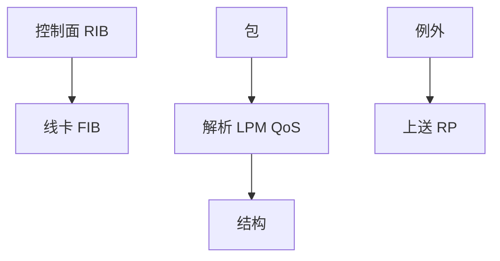

# 路由器架构

控制面算表，转发面按线速查表改头出队；两者用 FIB 快照耦合，慢路径例外上送。

<footer>—— 据 Kurose and Ross 路由器内部；Partridge et al., A 50-Gb/s IP Router, IEEE/ACM ToN 1998 整理</footer>

[交换机架构](/cs/switch-fabric) 已给二层结构。[上一课](/cs/ttl-traceroute) 结束选路课序。缺口是**路由器怎么拆**：路由处理器跑 OSPF/BGP，线卡查 LPM、TTL、ACL。本课不把 TCAM 电路写完。

## 问题

若每包都问 CPU，吉比特已不可及。架构：控制面维护 RIB，下发 FIB 到转发 ASIC；包：解析 → LPM → 改 TTL/MAC → fabric → 出口 QoS。例外：选项、过期、BGP 包上送。与交换机同构，多了三层与隧道封装。过订购同样存在。卫星高延迟不改内部时隙，只改会话数。

早期工作站路由器是软件；当代盒是分布式线卡。本课不点名型号。

### RIB 与 FIB 分离

控制面算表，线卡线速查。FIB 编程延迟造成瞬态不一致。例外上送，热路径不进通用内核。

## 方法

画：RP ↔ 线卡 FIB。对照主机[套接字](/cs/socket-api)：主机每包进内核；路由器数据面绕开通用 OS 热路径。BFD 可在线卡加速，仍属控制。

方法止于选定对象与对照；机制才说它如何嵌入已有分层与主干课。

## 机制

BGP 收敛先改 RIB 再编程 FIB，数据面滞后是「已通告但未转发」窗口。ECMP 组作为 FIB 下一跳组下发。EVPN Type 2 同样下到转发表。PMTUD ICMP 由控制面或线卡生成，取决于实现。

冗余 RP：ISSU/NSF 让转发在控制面重启时继续，对象是可用性。

## 边界

本课不引入网络处理器微码。TCAM 查表是下一课。后课默认：RIB/FIB 分离；线速在 ASIC。

「软件路由器」用 DPDK 把主机变成线卡，架构角色不变。

上一课留下的缺口在本课收口；「路由器架构」进入后课词汇表后只引用。文献用来钉对象与边界，不把本课写成该主题的独立综述。下一课[TCAM 查表](/cs/tcam-lookup)。

## 小结

- 控制面算，转发面查，FIB 是契约。
- 例外上送；热路径不进通用内核。
- FIB 编程延迟造成瞬态不一致。
- 后课只引用本课钉死的对象，不从该领域总问题重开。
- 出处：Kurose and Ross；Partridge et al., 1998。
