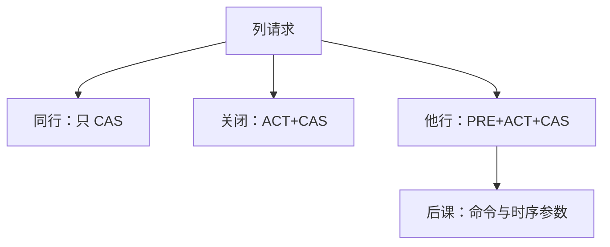

# 行缓冲与 bank 冲突

  
灵敏放大器里躺着当前打开的那一行：列命中只需 $t_{CAS}$；换行则要预充电再激活，同一 bank 上的冲突把延迟拉成好几倍。

  <footer>—— 据 JEDEC DDR SDRAM 时序；Hennessy and Patterson, CA:AQA 整理</footer>

[上一课](/cs/dram-organization)钉了层次。体系结构课[DRAM 时序](/cs/dram-timing)已写 $t_{RCD}$/$t_{CAS}$/$t_{RP}$。缺口是把**行缓冲**说成硬件状态：命中、缺失、冲突，以及为何多 bank 能掩盖冲突——否则后课调度没有优化目标。

## 问题

ACT 把一行读进该 bank 的行缓冲（灵敏放大器）。随后 READ/WRITE 走列地址，延迟 $t_{CCD}$/$t_{CAS}$ 一类。访问另一行：先 PRE（$t_{RP}$）再 ACT（$t_{RCD}$）。同一 bank 连续不同行 = bank 冲突。不同 bank 可交错命令。缺口不是新的组织名词，而是这三种访问的延迟差：行命中 ≪ 行空闲（已预充）≪ 行冲突。

页模式、打开页 vs 关闭页策略：保持行开以盼空间局部性，或立刻 PRE 以降低冲突代价。后课 FR-FCFS 偏向打开页。

### 行缓冲不是 CPU cache

它是 DRAM 内部的模拟+数字状态，不参与缓存一致性协议，不按缓存行标签查找。CPU 的 L1 命中根本不看见它。把 row buffer 当 L4，目录协议会画错。

JEDEC 用 Activate/Precharge/Read/Write 定义状态机。CA:AQA 用行命中率解释有效延迟。本课不把 RowHammer 扰动写成主体，点名存在即可。

## 方法

控制器为每 bank 记 `open_row` 或 `closed`。请求到达：同行则列命令；他行则 PRE+ACT+列；关闭则 ACT+列。bank 组规则限制同组连续 ACT。统计：行命中率随地址映射与程序步长变，下一课映射会改命中。

多通道：冲突是每通道本地的；全局带宽仍可叠加。

## 机制

地址交织把连续 cache 行洒到不同 bank，降低冲突、也可能降低行命中——折中在映射课。FR-FCFS 先服务能行命中的请求，可能饿死。HBM 银行更多，冲突模型同形。

## 边界

本课不列齐某代全部时序符号，不把内存控制器 RTL 写完。不进入加密侧信道（行缓冲时序泄漏）。不写光刻套准对电容的影响。

后课默认：延迟三档由行缓冲状态决定；bank 冲突是同一 bank 换行。

## 小结

- 行缓冲保存打开行；命中、空闲、冲突延迟差一个数量级。
- 多 bank 交错掩盖冲突；策略在打开/关闭页之间选。
- 不是 CPU cache。
- 出处：JEDEC DDR 时序；Hennessy and Patterson, CA:AQA。
