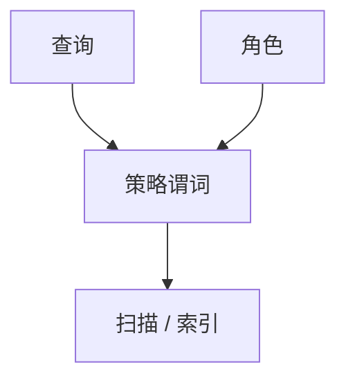

# 行级安全

视图和授权若只到表，租户仍能看见别人的行。行级策略把谓词接到扫描上，使「当前用户」成为计划的一部分。

<footer>—— 据 PostgreSQL RLS；关系系统安全视图传统</footer>

[上一课](/cs/jepsen-testing)查隔离是否撒谎。缺口是**谁被允许看见哪一行**：隔离正确仍可能越权。本课钉行级安全；审计下一课记谁读过。不把 RLS 写成密码学。

## 问题

`GRANT SELECT ON t` 太粗。RLS：对表附策略，`USING` 谓词在查询里合取。缺口是计划：策略必须稳定、可下推，否则每行调函数会打爆 OLTP。超级用户绕过、BYPASSRLS、安全定义者函数是常见洞。多租户用 `tenant_id = current_setting(...)` 必须防会话被改。

强制访问与自主访问不同。RLS 默认是自主的、可绕过的，除非角色设计把绕过封死。

## 方法

策略尽量用列与会话变量，避免每行查外表。测试：同一 SQL 换角色看行数。与视图：视图可漏 WITH CHECK。与审计：绕过事件也要记。与 TPC：基准角色通常是全能用户，测不出 RLS。

## 机制

策略是查询改写：计划里多一个滤子。索引能否服务该滤子决定 OLTP 能否活。漏 WITH CHECK 会让 `INSERT` 写进自己看不见的行。计划缓存必须按角色分键，否则串计划泄密或用管理员统计估错租户选择率。CDC 与复制槽通常绕过 RLS，权限要单开。向量/搜索侧过滤必须在 ANN 前或保证租户隔离，否则跨租户召回。

超级用户、BYPASSRLS、SECURITY DEFINER 函数是绕过面。物化视图与 FDW 也可能漏策略。会话变量若可被租户 `SET`，策略等于没有。

## 边界

本课不设计某云产品的 IAM。下一课审计是责任链，RLS 是强制滤子。不要靠 RLS 替代加密或 TDE。TPC 基准角色通常全能，测不出策略。

后课默认：多租户用强制行谓词且可下推。应用层 WHERE 不是 RLS——有基表权限就会绕过。

## 小结

- RLS 把授权谓词合进扫描；计划与绕过路径是漏洞面。
- 会话变量必须不可被租户改写；缓存按角色隔离。
- 数据库审计下一课。
- 出处：PostgreSQL RLS；安全视图传统。
