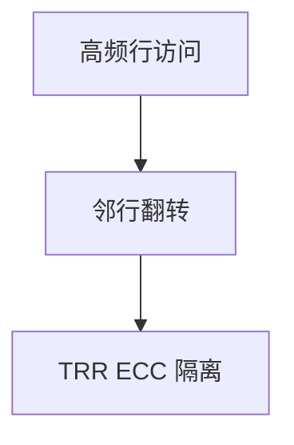

# Rowhammer 缓解

反复敲击 DRAM 行可使相邻行比特翻转。缓解是目标刷新、ECC、隔离敏感页、降低访问强度。它把内存从「可靠存储」改回物理设备。

<footer>—— Kim et al., Flipping Bits in Memory Without Accessing Them, ISCA 2014</footer>

## 定位

上一课[Spectre](/cs/spectre-mitigations)是 CPU 前端。缺口是**DRAM 扰动**。本课讲翻转与缓解，不给打穿的操作步骤。

后课默认已经读完本课钉下的合同，只补差，不从该领域第一性原理重开。

## 问题

隔离假设比特稳定。Rowhammer 打破。缺口：TRR、ECC、减少 clflush 一类高频访问、云共驻策略。

### ECC 不是万能

可纠正错误有限；多比特仍可能过。

Kim et al. 2014。禁止 Rowhammer 利用教程。Flush+Reload 下一课是缓存侧信道经典。

## 方法

陈述扰动物理。对策分层。下一课 Flush+Reload。

图中节点是本课的机制骨架；课程不把图展开成可运行的攻击步骤。

## 机制

硬件可靠性进安全模型。缓存侧信道下一课不翻转比特，只测时间。

前提写进合同之后，游戏外的误用只当失败模式点名，不在本课写成操作程序。

## 边界

零利用。ECC 只能纠正有限翻转，不能当「内存已诚实」的证明。Flush+Reload 下一课。

## 小结

- Spectre 测微结构；Rowhammer 翻 DRAM 比特。
- 刷新、ECC、隔离页提高代价。
- 内存不是抽象可靠寄存器。
- 下一课 Flush+Reload。
- 出处：Kim et al., ISCA 2014。

