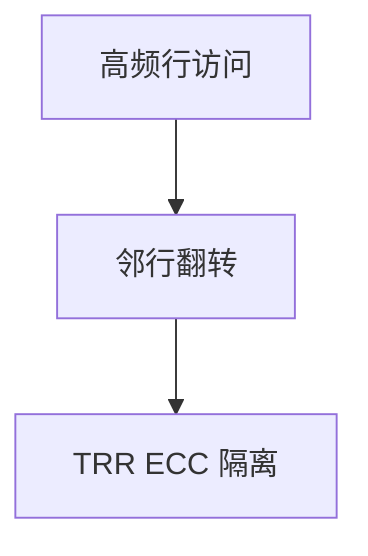

# Rowhammer 缓解

反复敲击 DRAM 行可使相邻行比特翻转。缓解是目标刷新、ECC、隔离敏感页、降低访问强度。它把内存从「可靠存储」改回物理设备。

<footer>—— Kim et al., Flipping Bits in Memory Without Accessing Them, ISCA 2014</footer>

上一课[Spectre](/cs/spectre-mitigations)处理 CPU 前端的预测执行；缺口下沉一层，来到 **DRAM 本身的物理扰动**。本课讲翻转机理与缓解分层，不给打穿的具体操作步骤。

后课默认已经读完本课钉下的合同，只补差，不从该领域第一性原理重开。

## 问题

隔离模型默认内存比特在不被写时保持稳定——你没写别人的页，就读不出变化。Rowhammer 打破的正是这条假设：对同一 DRAM 行高频反复激活，相邻行的电容被感应泄漏，从未被触摸的页里也会翻转比特。缺口是缓解怎么分层：目标行刷新（TRR）、ECC、减少 clflush 一类绕过缓存的高频访问、以及云上禁止与敏感数据共驻。

### ECC 不是万能

服务器级 ECC 对每个 64 比特字通常只配 8 个校验位，能纠正单比特、检测双比特；Rowhammer 一次能在同一字里翻出更多比特，纠错子直接失守，若翻的恰是校验位本身，错误还会被当成「已纠正」静默放行。

Kim et al. 2014。禁止 Rowhammer 利用教程。Flush+Reload 下一课是缓存侧信道经典。

## 方法

方法不是堵某个漏洞，而是先陈述扰动物理再分层配对策：硬件层靠 TRR 在激活邻行时插入刷新，靠 ECC 兜住残余翻转；软件层靠去掉 clflush 一类精确驱逐原语，抬高攻击者维持高频访问的成本；部署层靠页隔离与共驻审计，把攻击者的物理行与敏感行分开。每一层都只是抬高代价，不是根除。下一课 Flush+Reload。

```mermaid
flowchart TD
  HAMMER["高频行访问"] --> FLIP["邻行翻转"]
  FLIP --> MIT["TRR ECC 隔离"]
```

## 机制

Rowhammer 把硬件可靠性重新放进安全模型：此前 DRAM 的比特翻转被当成宇宙射线级的概率噪声，交给 ECC 静默吸收；现在翻转可由用户态程序定向制造，内存从「可靠存储」退回物理设备。评价缓解要看它封的是哪条失效路径：TRR 假设攻击者只能锤有限几行，双面锤击恰好顶到这条假设；ECC 假设错误稀疏且独立，定向多比特翻转违背独立性。缓存侧信道下一课不翻转比特，只测时间。

## 边界

本课零利用：不给凑行地址，不给锤击序列。ECC 只能纠正有限翻转，不能当「内存已诚实」的证明；TRR 也在更新的颗粒上屡被绕过——两者是追赶关系。Flush+Reload 下一课。

## 小结

- Spectre 测微结构；Rowhammer 翻 DRAM 比特。
- 刷新、ECC、隔离页提高代价。
- 内存不是抽象可靠寄存器。
- 下一课 Flush+Reload。
- 出处：Kim et al., ISCA 2014。

