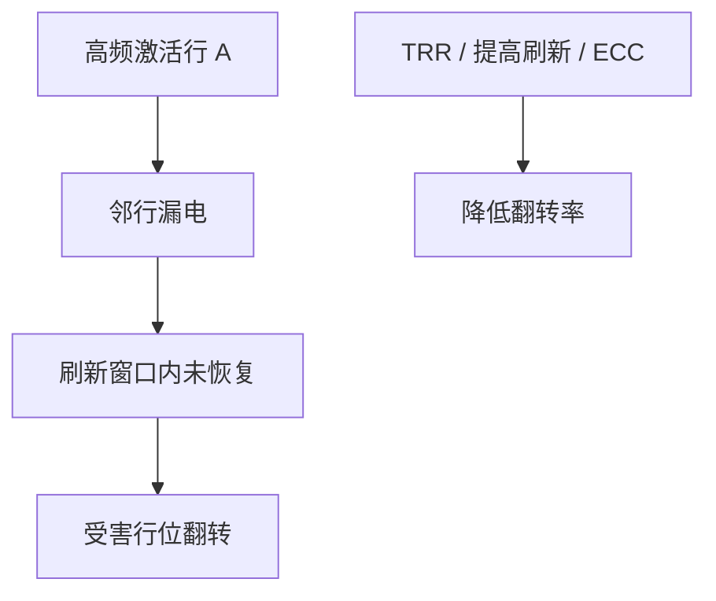

# Rowhammer

对相邻 DRAM 行的高频激活会在受害行上积累漏电，刷新来不及则位翻转；协议与 ECC 按「随机 FIT」设计时，会被这种定向扰动打穿。

<footer>—— 据 Kim et al., Flipping Bits in Memory Without Accessing Them, ISCA 2014 整理</footer>

[上一课](/cs/meltdown-kpti) 仍在 CPU 推测与页表。[DRAM 刷新](/cs/dram-refresh) 假定干扰是均匀的。[MTTF](/cs/mttf-redundancy) 的 ECC 对付稀疏随机翻转。本课不提供如何对准受害行的程序。缺口是 **Rowhammer：激活干扰作为微结构/器件现象，以及刷新与隔离行等缓解。**

## 问题

DRAM 阵列密，激活一行会在邻行耦合。若某行被反复打开（cache 缺失或显式 flush 使访问到达 DRAM），邻行电荷掉到阈值以下。缺口不是 [MESI](/cs/mesi-protocol) 错了——内存控制器按合法命令在工作——而是**器件层让「合法高频访问」变成对邻行的写。**

Kim 等在 2014 年公开此现象。缓解包括提高刷新率、TRR（追踪行刷新）、隔离行、ECC 升级。没有一种在所有代际上免费且完美。

## 方法

微结构视角：LLC 与预取决定哪些行真正打到 DRAM；行缓冲策略影响激活频率。系统：内存控制器检测异常激活模式则对邻行额外刷新。OS：降低敏感页与攻击者页的物理邻接（有限）。本课不描述如何绕过 cache 去锤某一物理行。

## 机制

与 Spectre：不需要预测器；需要的是物理邻接与激活。ECC 可能把翻转变成可检测错误，双比特以上仍可能漏。这把「正确性」从 ISA 扩展到器件。最后一课缓存侧信道回到 SRAM 时序，不依赖 DRAM 翻转。

刷新率加倍直接打带宽与功耗，是粗暴但明确的 MTTF 旋钮。TRR 试图只刷新「被打的邻居」，实现细节各代不同，教学上只需：内存控制器必须把激活历史当成可靠性输入，而不只是时序状态机。

## 边界

本课不评估具体芯片是否仍可被诱导翻转。也不把云厂商的专有缓解当定理。Prime+Probe 是缓存占用编码，与 Rowhammer 正交：一个读时序，一个写邻居电荷。

后课默认：DRAM 命令流有物理副作用。SRAM cache 的命中/缺失时序是更经典的侧信道介质。

## 小结

- Rowhammer 是合法激活对邻行的电荷干扰，超出随机 FIT 模型。
- 缓解在刷新策略与行追踪，有功耗与带宽税。
- 缓存占用时序是下一课 Prime+Probe。
- 出处：Kim et al., *ISCA*, 2014。
