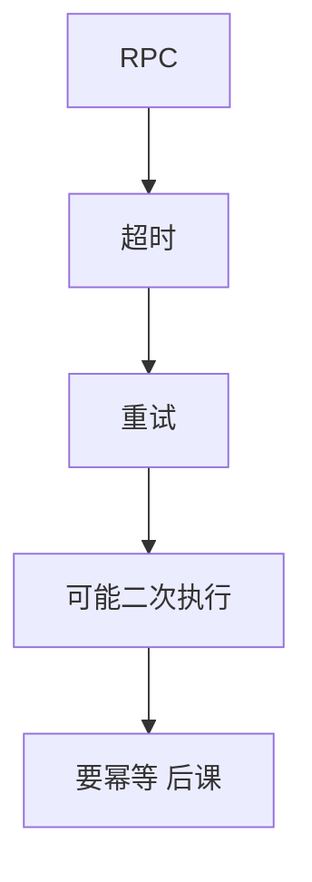

# RPC 语义

远程调用看起来像本地过程，失败模式不像。至少一次、至多一次、恰好一次是对「过程执行了几次」的承诺，不是营销。

<footer>—— 据 Birrell and Nelson, Implementing Remote Procedure Calls, TOCS 1984；Spector, Performing Remote Operations Efficiently, CACM 1982 整理</footer>

共识单元以[PoW 直觉](/cs/pow-blockchain-consensus)封口。系统模式课序从通信开始。缺口不是再选主，而是**一次调用在故障下执行了几遍**。本课钉 RPC 的执行语义。后课投递语义把消息层的至少/至多说清，二者常被混名。

## 问题

Birrell–Nelson：桩、报文、绑定、超时。本地调用：进程活则恰好执行一次。RPC：请求丢、应答丢、服务器崩在执行前/中/后，客户端超时后看见的都是「没回来」。缺口：重试会把「执行前崩」变成成功，也会把「执行后应答丢」变成执行两遍。

Spector 把远程操作分成至少一次、至多一次等。至少一次：重试直到一次成功应答，执行次数 $\ge 1$（若终成功）。至多一次：执行次数 $\le 1$，可能零次（超时后不知道）。恰好一次：又回到共识与幂等的税。

「at-most-once」常靠服务器端调用 ID 表实现，表要有过期，过期后又滑回至少一次。本课先定词。

## 方法

接口必须声明语义。默认最常见的工程是：超时重试 + 希望处理函数幂等 ≈ 试图至少一次。真至多一次：服务器记住 `(client, xid)` 的结果。真恰好一次：把调用当 RSM 命令或用事务。

不要把 TCP 「恰好一次字节流」当成恰好一次过程：流保证段，不保证应用执行与应答的原子。

## 机制

崩溃恢复：服务器若在执行后、记 xid 前崩，至多一次表会漏，重试再执行。xid 必须与副作用同事务落盘——又接到 WAL。无状态服务器最容易做成至少一次。

绑定与版本：桩与服务器 stub 不一致是另一类失败，不是执行次数。本课点名。部分同步下超时只是[检测器](/cs/failure-detectors)，不能当「对方没执行」的证明——这是 FLP 在 RPC 上的投影。

本课不写 gRPC 流式 API 全文，不写限价簿下单 RPC。

## 边界

本课不把消息队列的投递保证写完（下一课）。不引入 Saga。后课默认：说到 RPC，先问三次语义；超时后的知识状态是「不知道」，除非服务器给了持久 xid 结果。幂等键是把至少一次压成效果一次。

本地过程的等式在远程不成立。失败是常态规格，不是异常注释。

## 小结

- 至少一次、至多一次、恰好一次谈的是执行次数。
- 超时后客户端不知道；重试提高执行次数。
- TCP 字节可靠 ≠ 过程恰好一次。
- 出处：Birrell and Nelson, TOCS 1984；Spector, 1982。
