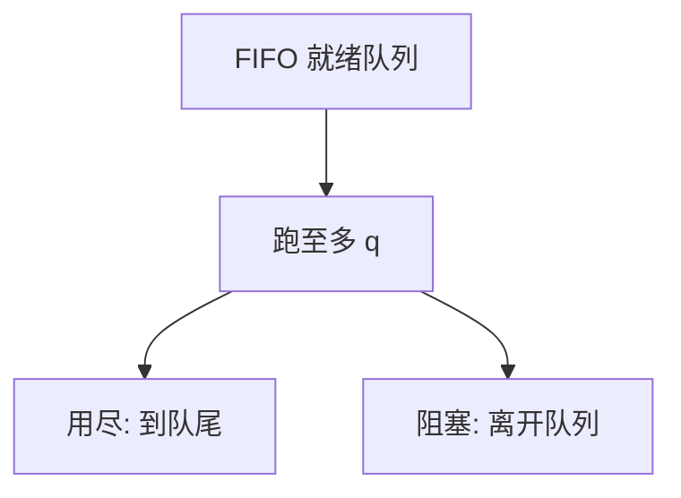

# 时间片轮转

轮转给每个可运行任务一个量子；用完则排到队尾。片太短切换税吃掉吞吐，片太长退化成 FCFS。

<footer>—— 据 Silberschatz et al., Operating System Concepts 整理</footer>

[上一课](/cs/fcfs-sjf)的非抢占策略对交互没有响应上限。时钟中断已经能把 CPU 抢回来。[调度指标](/cs/scheduling-metrics)里响应时间正是为这种抢占准备的。缺口是 **RR**：runqueue 当环形 FIFO，每条任务最多连续跑一个量子 $q$。本课钉量子与指标的折中，不引入多级队列。

## 问题

击键处理若要等当前编译突发结束，响应不可接受。RR：时钟减量子，到零则切换并把当前任务接到队尾。I/O 型往往用不完 $q$ 就阻塞，等于自动偏向短突发。缺口不是 SJF 的估计，而是用**固定抢占周期**逼近公平的人次均等。

$n$ 个可运行任务时，一条任务最迟大约 $(n-1)q$ 后再摸到 CPU（忽略切换税）。这是响应的上界直觉，不是硬实时保证。

## 方法

选 $q$。相对一次突发：若 $q$ 大于绝大多数突发，RR ≈ FCFS；若 $q$ 接近一次内核切换的代价，利用率塌掉。教材常用几十毫秒量级作讨论，不是定律。切换仍走[上下文切换](/cs/context-switch)；FPU 惰性在 RR 下更值钱，因为切得勤。

唤醒入队位置：队尾（常见）或按规则插队；本课默认队尾，以免刚唤醒的立刻垄断。

## 机制

RR 把公平定义成人次轮流，不认权重：后台编译与前台击键同一 $q$。这正是后课 CFS 要改的点，本课先把「无权重轮转」钉死。对纯 CPU 型集合，平均等待往往差于 SJF，但响应方差小。传送带效应被量子切开。

与 idle：只有 idle 可跑时不轮转它与自己。

## 边界

本课不把 POSIX `SCHED_RR` 的实时轮转与分时 RR 混成一种队列。也不把动态调整 $q$ 的启发式写完。优先级尚未进场；所有人同一档。

后课默认：固定量子改善响应、人次公平。要用近期行为把任务分进不同量子档，下一课讲多级反馈队列。

## 小结

- RR：量子到则队尾；响应有与 $n q$ 相关的直觉上界。
- $q$ 在切换税与 FCFS 化之间折中；无权重。
- 按行为分档是 MLFQ 的缺口。
- 出处：Silberschatz et al., *OSC*；Tanenbaum and Bos, *MOS*。
