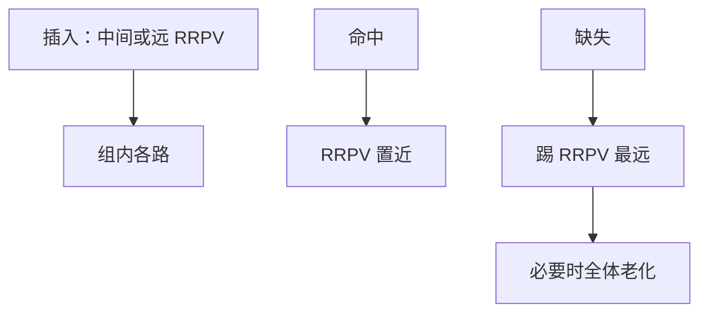

# RRIP 与死块预测

新填入的块不一定立刻还要再用；把它插在「较远再引用」而不是 MRU，扫描就冲不掉真正的热块。死块则是填进来之后再也不会命中的行。

<footer>—— 据 Jaleel et al., High Performance Cache Replacement Using Re-Reference Interval Prediction, ISCA 2010 整理</footer>

[上一课](/cs/lru-plru) 的 LRU 把新块当 MRU。扫描或一次性流会把热工作集冲光，然后自身也不再命中——典型的容量/冲突混合痛点。本课不重做 PLRU 树。缺口是**用再引用间隔预测（RRIP）改变插入位置**，并点名死块：占着 SRAM 却零命中。

## 问题

L2/L3 上看流式缺失：每个块用一次。LRU 让它们从 MRU 走到 LRU 的路上挤走循环核。若新块插入时就当成「很久以后才再用」（甚至「可能再也不用」），热块可以留住。缺口不是加路，而是**给每路一个饱和的再引用预测值，替换踢预测最远的**。

Jaleel 等的 SRRIP：若干位 RRPV，插入取中间值，命中置 0（近再引用），替换踢 RRPV 最大者并老化其他。BRRIP 用双峰插入对付扫描。

## 方法

每路存 RRPV。缺失：在 RRPV 最大的路里挑牺牲者；若没有最大，把所有 RRPV 加一再找。命中：该路 RRPV ← 0。插入：SRRIP 用 $2^k-2$ 一类的中间值；检测到扫描则用 BRRIP 以高概率插成「远」。

死块预测（DBP）：用 PC 或踪迹学习「这块填完不会再命中」，插入即标为可替换或根本不填 L3。它与 RRIP 互补：一个改间隔，一个预测零命中。

## 机制

LLC 的命中率对替换极敏感，因为缺失要去 DRAM。[CPI](/cs/cpi-amdahl) 的访存项在这里被替换策略移动。L1 仍常用 LRU/PLRU：命中延迟更重要，扫描相对少。预取块的插入 RRPV 往往更「远」，以免污染，与后课预取污染是同一旋钮。

## 边界

本课不把所有学术替换器（DRRIP、SHIP、Hawkeye）列成菜单。也不把死块预测做成必须实现的单元。VIPT 的索引/标签拆分是下一课，与 RRPV 无关但决定「组」怎么找。

后课默认：LLC 插入不必是 MRU；扫描用远插入保护热块。组的索引用虚还是实用，下一课 VIPT。

## 小结

- RRIP 用再引用间隔而不是「刚用过 = 最热」来替换。
- 死块预测针对填入后零命中的行。
- 虚索引物理标签是下一课的时序技巧。
- 出处：Jaleel et al., *ISCA*, 2010。
