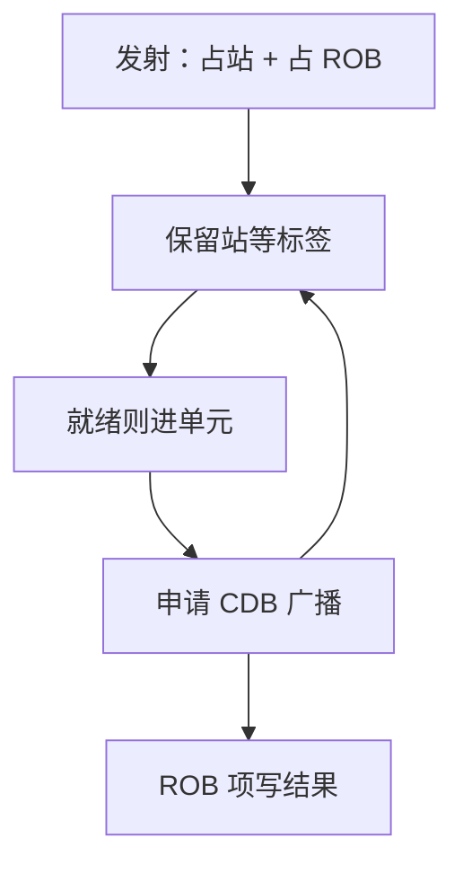

# 保留站与公共数据总线

站里等的是标签不是架构寄存器名；结果一旦上场，所有匹配的站在同一拍抓住数据。

<footer>—— 据 Tomasulo, An Efficient Algorithm for Exploiting Multiple Arithmetic Units, IBM Journal 1967；Hennessy and Patterson, CA:AQA 整理</footer>

[上一课](/cs/tomasulo)已经用保留站、标签与 CDB 讲完唤醒故事，并与 ROB 叠放。[乱序与 ROB](/cs/ooo-rob) 钉了提交纪律。本课不重讲精确异常。缺口是把站与 ROB 的分工、以及 CDB 作为**带宽资源**写清：谁分配站、站满停发射、广播口每拍只能交几份结果。上一课把这些当成背景；超标量宽度一加，它们变成结构冒险。

## 问题

ROB 项托住未提交结果，但功能单元从哪读操作数？若每条指令都等 ROB 头，又退回顺序。保留站是发射后、执行前的窗口：操作数或等待标签存在站里，就绪调度器挑站进 ALU。缺口不是再发明标签，而是**站容量、CDB 端口与 ROB 容量是三个不同的队列**，任一满都让 IPC 掉到利用率公式里。

CDB 原是一条广播总线。同时完成的两个乘除法会抢总线：这是结果唤醒上的结构冲突。

当代核用点对点数据网络加唤醒矩阵，语义仍是「标签匹配则写操作数」。教学继续用 CDB 这个词。

## 方法

发射：若有空站且有空 ROB 项，写入操作码、已就绪的值、未就绪的标签、目的标签（常等于 ROB 下标）。寄存器状态表指向该标签。执行完成：申请 CDB；获准则广播 `{标签, 值}`，匹配的站与 ROB 项写数据，站释放。

load 站还要等地址与 store 序；那是下一课存储缓冲。本课只要求 ALU/FPU 结果走 CDB。

## 机制

唤醒延迟加在 RAW 的关键路径上：结果产生 → 总线仲裁 → 站写端口 → 下一拍才可发单元。深度流水的核把这拆成多拍。站按单元分体（加减一堆、乘一堆）可减少比较器，但负载不均。

冲刷：误预测或异常时，站与标签整批作废，状态表回到 ROB 头映射。CDB 上已飞的结果若标签属于被杀指令，丢弃。

## 边界

本课不引入记分牌对照的完整日程表，不把 SMT 的多份寄存器映射请进来。store 与 load 的地址匹配、store-to-load 转发，是下一课。也不把 CDB 当成一致性总线：它只在核内。

后课默认：乱序唤醒 = 站内标签匹配 + 广播。访存指令另有缓冲与绕过。

## 小结

- 站管就绪执行，ROB 管按序提交；两者都满会停发射。
- CDB 每拍端口有限，完成结果会结构冲突。
- load 绕过 store 缓冲是下一课。
- 出处：Tomasulo, *IBM J. R&D*, 1967；Hennessy and Patterson, *CA:AQA*。
