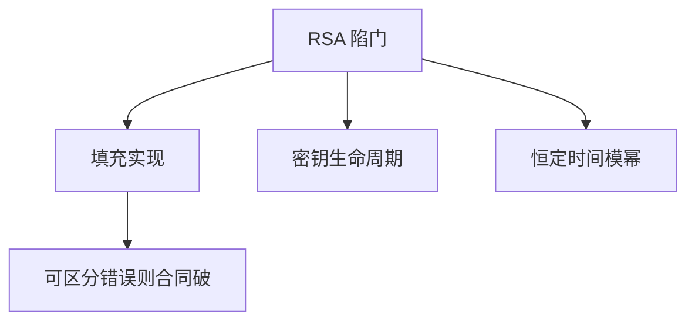

# RSA 攻击面

RSA 的数学对象很稳，工程对象很脆：填充实现、密钥复用、小指数广播、侧信道比「分解模数」更常把系统打穿。

<footer>—— Boneh, Twenty Years of Attacks on the RSA Cryptosystem, Notices of the AMS, 1999；对照 Anderson 对实现失败</footer>

## 定位

上一课[OAEP](/cs/rsa-oaep)给出正确填充。缺口是**错误清单**：哪些合同一破，归约作废。本课只列机制与防御，不提供利用步骤或参数求解程序。

后课默认已经读完本课钉下的合同，只补差，不从该领域第一性原理重开。

## 问题

OAEP 在实现里若回退到 PKCS#1 v1.5 加密，历史 Bleichenbacher 预言机就会回来——只陈述「可区分的填充错误」。共模多指数、低加密指数广播、公共私钥因子，都是密钥管理与参数选择失败。缺口是把这些收成「不要做」，而不是重讲分解算法。

### 侧信道也算攻击面

模幂若按比特走不同时间或不同缓存，密钥位可漏。[侧信道](/cs/side-channel)已给模型，本课只把 RSA 实现标进同一模型。

Boneh 1999 综述是合法文献。课程禁止复现其中的构造步骤。防御：OAEP/PSS、恒定时间、一密钥一用途、足够大的随机填充、换 ECDH。

## 方法

按来源分类：填充预言、代数关系（共模/广播）、弱素数生成、实现泄漏。每类对应一条工程规则。指向后课 ECDH：许多新协议直接离开 RSA 封装。

图中节点是本课的机制骨架；课程不把图展开成可运行的攻击步骤。

## 机制

可证明安全只在游戏前提成立时成立。攻击面课的工作是列出前提：唯一用途、不可区分失败、随机填充、大模数、无泄漏实现。分解本身仍难，不等于产品安全。

前提写进合同之后，游戏外的误用只当失败模式点名，不在本课写成操作程序。

## 边界

本课不写因数分解或 Coppersmith 方法的操作指导。下一课椭圆曲线 DH：换群，不换「封装会话键」这一层目标。

## 小结

- OAEP 是正确形状；实现与密钥管理才是常见破口。
- 可区分填充错误、共模、弱随机，都让归约退出。
- 一密钥一用途；恒定时间。
- 后课 ECDH/X25519 换群做协商。
- 出处：Boneh, 1999；Bleichenbacher（作为历史失败模式点名）；Anderson, *Security Engineering*。
