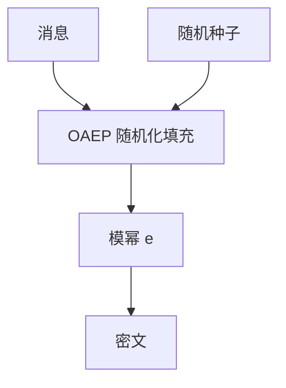

# RSA 与 OAEP

RSA 函数是模幂；直接加密短消息既不确定也不抗选择密文。OAEP 用哈希做随机化填充，把 RSA 收成在随机预言机模型下可达到 CCA 目标的信封零件。

<footer>—— Rivest, Shamir and Adleman, 1978；Bellare and Rogaway, Optimal Asymmetric Encryption Padding, EUROCRYPT 1994；PKCS #1 v2</footer>

## 定位

上一课[生日攻击](/cs/birthday-attack)钉了哈希宽度。主干[公钥信封](/cs/pubkey-envelope)与[DH 与 RSA 分工](/cs/dh-vs-rsa)已把 RSA 当封装选项。缺口是**明文不能直接当模幂输入**：必须填充。本课收 OAEP，不重推欧拉定理。

后课默认已经读完本课钉下的合同，只补差，不从该领域第一性原理重开。

## 问题

教科书 RSA $c=m^e\bmod n$ 确定、可乘性，选择密文下可被操纵。OAEP：用随机种子和哈希把 $m$ 扩成类似一次一密的掩码块再模幂。TLS 1.3 已不用 RSA 密钥传输，但签名与遗留封装仍要理解填充。缺口是填充合同，不是再讲因数分解叙事。

### 签名填充是另一套

PSS 与 PKCS#1 v1.5 签名填充下一课攻击面才对照。加密填充与签名填充不能混用同一密钥语义而不加域分离。

Bellare–Rogaway OAEP。Fujisaki–Okamoto 等是同类「把陷门置换收成 CCA」的框架，本课只钉 OAEP。不要发明 arXiv 编号。

## 方法

写 RSA 陷门置换角色：公钥 $(n,e)$ 公开，私钥 $d$ 解幂。OAEP 的两轮 Feistel 式掩码（用 $G,H$ 哈希）。对照：哈希宽度受生日界约束，种子必须真随机。

图中节点是本课的机制骨架；课程不把图展开成可运行的攻击步骤。

## 机制

信封仍是：RSA 只封对称键，数据走 AEAD。OAEP 让封装在理想哈希下可归约到 RSA 陷门。实现必须常数时间模幂与严格的填充校验——校验失败不可区分，否则又是预言机。

前提写进合同之后，游戏外的误用只当失败模式点名，不在本课写成操作程序。

## 边界

本课不给选择密文操纵的步骤。下一课 RSA 攻击面：填充实现、共模、广播、小指数，全部当失败模式与防御，不当配方。

## 小结

- 生日界约束填充里的哈希；RSA 要随机化填充。
- OAEP 把陷门置换收成 CCA 向的封装。
- TLS 1.3 不用 RSA 传输密钥；遗留与签名仍要填充。
- 下一课：填充与数论误用的攻击面清单。
- 出处：Rivest, Shamir and Adleman, 1978；Bellare and Rogaway, 1994；PKCS #1。
