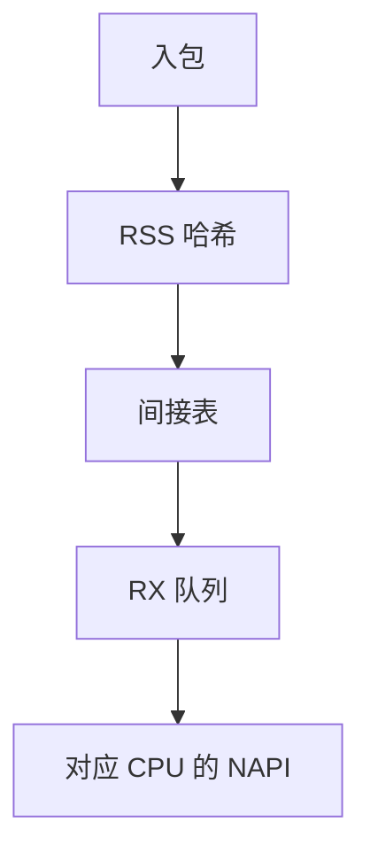

# RSS 与多队列网卡

RSS 用包头哈希选择接收队列，每队列绑不同 CPU 的 NAPI，使多流并行而不在单核 livelock。

<footer>—— 据 Microsoft RSS 白皮书直觉；Linux 对 indirection table 与 XPS 的文档</footer>

[NAPI](/cs/napi) 每队列一份。[DPDK](/cs/dpdk-kernel-bypass) 也按队列绑核。缺口是 **RSS**：硬件把流散开，以及 XPS 在发送侧对称。不是存储 mq 的复制粘贴——哈希对象是五元组。

## 问题

单队列：万兆一根 NAPI 打满一核。RSS：NIC 算 hash，查间接表得队列号，MSI-X 到对应 CPU。缺口：哈希不对称则转发方向换核，缓存冷；对称 RSS 或 Toeplitz 密钥配置；RPS 是无 RSS 硬件时的软件 steer。本课不把每一家 ethtool 字段当作业。

Flow Director / aRFS 可把已有套接字所在核告诉网卡。XPS：发送队列按 CPU 选，减少跨核锁。

## 方法

初始化：建 N 对 RX/TX 队列，设间接表。运行：同五元组进同队列，TCP 同流有序。对照 [blk-mq](/cs/blk-schedulers)：blk-mq 按提交者 CPU；RSS 按包头，与提交者无关。对照 netns：每设备自己的队列，veth 软件哈希另说。

## 机制

RSS 把并行从「更多中断」变成「更多队列」，是多核网络的默认几何。它不保证应用线程在同一核——还要 RFS 或用户绑核。不要写成量化分片。与 [GRO](/cs/gro-gso)：GRO 在单队列内合并，跨队列不能拼同一流（同流本应同队列）。

重配置队列数会扰动亲和，生产上要谨慎。

实现上：间接表可把部分队列置零以离线 CPU。对称哈希让转发五元组双向同队列。隧道封装后若只哈希外层，内层流会撞同一队列。 读法上只引用[上一课](/cs/dpdk-kernel-bypass)的结论，不把对象换成训练推理或限价簿。

本课在操作系统进阶的「网络栈 / 收发路径」课序里，对象是 **RSS 与多队列网卡**。

- 先修只引用，不重导：上一课的结论当公理，本课只补差。
- 五栏不吞并：不把本课写成大模型训练/推理，也不写成限价簿或权重量化。
- 文献用 OSTEP、McKusick、内核文档与具名会议论文；不发明 arXiv 编号。

## 边界

本课不引入 infiniband 的 RQ 与 CQ 命名（RDMA 后课）。不保证隧道封装后内层哈希（RSS 可能只看外层）。下一课把拷贝再削：零拷贝网络。

版本字段会变，课序钉的是机制对象「RSS 与多队列网卡」，不是某一主线内核的结构体名。
后课默认：多队列靠 RSS 散列到 CPU。发送/接收少拷贝的机制，下一课。

## 小结

- RSS 按流哈希选 RX 队列并绑 CPU。
- XPS/RFS 补发送与应用核亲和。
- 零拷贝网络是下一课。
- 出处：RSS 文献；Linux networking；ethtool 队列。
