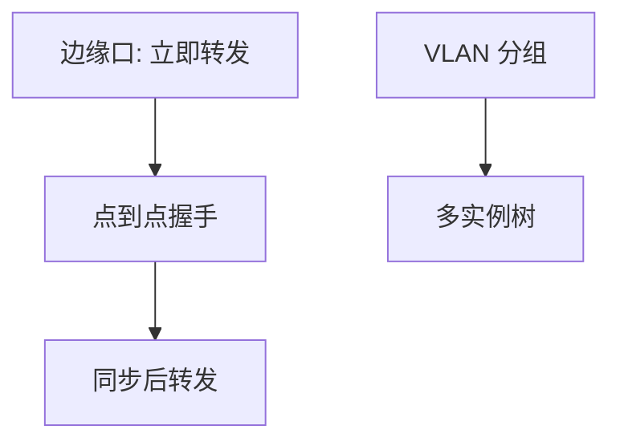

# RSTP / MSTP

RSTP 用提议/同意握手把端口从阻塞拉到转发，秒级收敛；MSTP 让多棵树共享区域，按 VLAN 组走不同根。

<footer>—— 据 IEEE 802.1w RSTP；IEEE 802.1s / 802.1Q MSTP；Perlman 生成树原文对照整理</footer>

主干[生成树](/cs/spanning-tree) 已钉根桥与阻塞。[上一课](/cs/lldp) 不改拓扑。缺口是**收敛太慢与一棵树不够**：经典 802.1D 计时器以 30–50 s 计；RSTP 用握手；MSTP 把 VLAN 映射到多实例，避免所有 VLAN 共用一条阻塞。本课不把 MAC 学习算法写完。

## 问题

接入口接主机，不必等转发延迟：edge 口可直接转发，BPDU 守卫防环。点到点口用 proposal/agreement 同步子树。MSTP：一个区域里多棵 IST/CIST 与 MSTI，VLAN 映射表必须全区一致，否则环或黑洞。这不是 IP 的 ECMP，仍是二层无环。

不要把 RSTP 的「秒」当成应用 SLA：还有 MAC 刷新与上层超时。

802.1Q 已并入 RSTP/MSTP。PVST+ 是厂商对照：每 VLAN 一棵，开销大。本课以标准 MSTP 为主。

### 秒级仍是二层树

握手替代长转发延迟，不是 IP ECMP。MSTP 映射必须全区一致，否则环或黑洞。边缘口快转发仍要 BPDU 守卫。

## 方法

对照：STP 计时器 vs RSTP 握手 vs MSTP 实例。画：区域边界用 CIST 与外网相连。根优先级仍决定哪台转发多。LACP 逻辑口作为一条 RSTP 边。

方法止于选定对象与对照；机制才说它如何嵌入已有分层与主干课。

## 机制

LLDP 名字帮你确认插线；RSTP 决定哪些口真正发数据。PFC 暂停不替代阻塞：阻塞是拓扑，暂停是队列。主干 VLAN 课的广播域在 MSTP 里可以有不同的转发树，减少绕路。

TCN：拓扑变仍要冲刷 MAC，否则帧跟旧口走。后课 MAC 学习会收回这句。

## 边界

本课不引入 TRILL/SPB 的链路状态二层。MAC 学习与洪泛是下一课。后课默认：当代二层环保护以 RSTP/MSTP 为默认词汇。

数据中心后课常用 Clos + L3，少跑大二层；那是后话，不在本课废除生成树。

上一课留下的缺口在本课收口；「RSTP / MSTP」进入后课词汇表后只引用。文献用来钉对象与边界，不把本课写成该主题的独立综述。下一课[MAC 学习与洪泛](/cs/mac-learning)。

## 小结

- RSTP 握手替代长转发延迟；边缘口快。
- MSTP 按 VLAN 组多树，映射必须一致。
- 仍是无环二层，不是路由 ECMP。
- 后课只引用本课钉死的对象，不从该领域总问题重开。
- 出处：IEEE 802.1w/s；Perlman, 1985。
