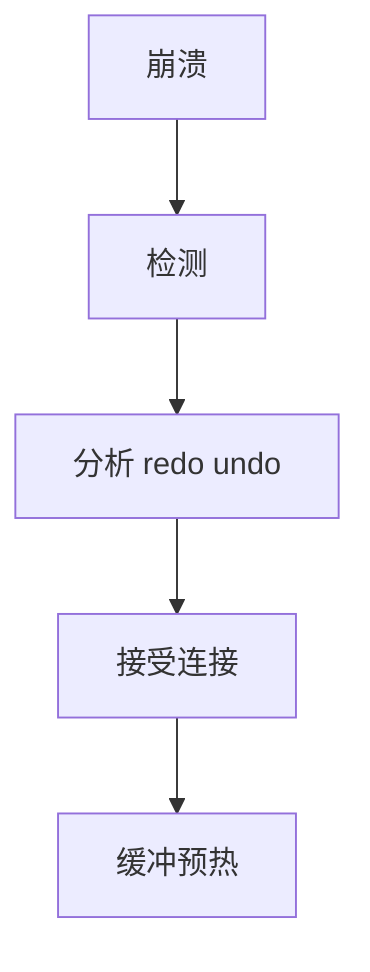

# RTO 与恢复

RTO 是允许的停机预算：分析+redo+undo+打开连接要落在预算内。检查点间隔、日志设备、并行 redo 是杠杆，不是口号。

<footer>—— 据 Gray and Reuter 恢复时间；ARIES 三阶段；运维 RTO/RPO</footer>

[上一课](/cs/durability-levels)钉了丢多少。本课钉**多久能服务**：恢复时间目标（RTO）。模糊检查点缩短 redo 前缀；并行 redo 缩短墙钟；undo 未决事务量也算。备份后课是另一条「从零拉起到某时间点」的 RTO。

## 问题

崩溃：启动三阶段。redo 体积 ≈ 检查点以来的日志 × 应用速度。脏页多、日志在慢盘、单线程 redo，RTO 爆炸。缺口是把恢复当性能路径设计：日志盘、redo 并行度、检查点节奏、崩溃时未决事务数（长事务 undo 长）。

演练：不演练的 RTO 是假的。与计划回归不同，这是运维不变式。

RTO 含故障检测、选主、DNS、连接池排空。本课核心是库进程恢复。检测与租约在分布式课。

## 方法

预算分解：检测 $t_d$ + 分析 $t_a$ + redo $t_r$ + undo $t_u$ + 预热 $t_w$。杠杆：更频检查点降 $t_r$；限制长事务降 $t_u$；备库升主把 $t_r$ 换成复制延迟（可能更短）。预热：缓冲池空则刚恢复仍慢，要预热或接受缓存冷。

监控：上次恢复各阶段耗时。日志积压告警等于 RTO 恶化预警。

## 机制

与组提交无关直接，但日志设备共享会让运行与恢复抢。doublewrite 恢复先修页，计入 $t_r$。逻辑重放备库的 RTO 是重放追上，不是 ARIES。

云盘快照恢复：RTO 含挂载与 WAL 追，粒度不同。

## 边界

本课不讲 PITR 选时间点。也不把 RTO 当隔离级别。半同步影响的是故障时 RPO 与是否能立刻升主。

后课默认：RTO 可分解、可演练、用检查点与并行 redo 调。备份与 PITR：从备份基线+日志前滚到任意点。

没有预热的「已恢复」对用户仍是超时。

## 小结

- RTO 分解为检测与三阶段加预热。
- 检查点、并行 redo、限制长事务是杠杆。
- 备份与 PITR 下一课。
- 出处：Gray and Reuter；ARIES；RTO/RPO 实践。
