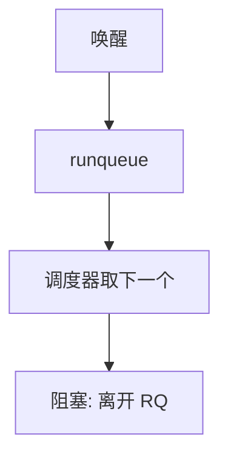

# 运行队列

调度器不是在全系统扫描 PCB；它只看运行队列里「可运行」的那些，每颗 CPU 还可以有自己的队列。

<footer>—— 据 Love, Linux Kernel Development；Silberschatz et al. 整理</footer>

[上一课](/cs/cpu-vs-io-bound)说明就绪者突发长度不同。[idle 线程](/cs/idle-thread)在队列空时上场。缺口是**运行队列（runqueue）**：就绪且未在跑（或可被抢的）任务挂在这里，调度器 O(1) 或 O(log n) 取出下一个。阻塞的人在等待队列上，不在 runqueue。本课只钉这道数据结构，不比较 FCFS 与 SJF。

## 问题

若每次时钟中断都遍历所有 PCB 找 `TASK_RUNNING`，核多任务多时不可扩展。[per-CPU 数据](/cs/percpu) 已经暗示：每 CPU 一条 runqueue，本核调度只看本地，跨核靠后课迁移。缺口不是指标定义，而是「可运行集合」的显式容器：入队在唤醒与创建时，出队在睡眠与结束时。

正在本核运行的任务可视为队列的特殊成员或单独的 `current`。教学上把「可被选中的」都算进 runqueue 即可。

## 方法

单核教材：一条 FIFO 或按优先级的多槽。多核：每 CPU 本地队列 + 偶尔平衡。入队：唤醒路径把任务从等待队列挪到某 runqueue，必要时 IPI 踢目标核。出队：主动睡或被切走后若仍可运行则留在队列（抢占式轮转）。选下一个：按策略看队头或树的最左结点——策略是后课。

与[PCB](/cs/pcb-task-struct) 的关系：PCB 上有「挂在哪条队列」的链指针；同一任务不能同时在两条 runqueue 上。

## 机制

runqueue 把调度从「哲学上选谁」变成「对这个容器操作」。I/O 型频繁入出队；CPU 型长时间占着 `current`。锁：操作某条队列要持该队列锁（或等价），不能在硬 IRQ 里乱入队而不标注上下文。具体锁是同步课；本课只要求队列是共享数据。

空队列 ⇒ idle。这把上一课 idle 接到容器上。

## 边界

本课不把 CFS 红黑树或 EEVDF 的树当唯一实现，不写 `nr_running` 的所有会计。全局共享一条队列在多核上会成为锁热点，所以默认讲 per-CPU。亲和与迁移下一组课再收。

后课默认：可运行任务在 runqueue 上。按到达顺序或按长短来选队头，下一课讲 FCFS 与 SJF。

## 小结

- runqueue 是可运行任务的容器；阻塞者不在其中。
- 多核上通常 per-CPU，以免扫描全世界。
- 队头如何定义是 FCFS/SJF 的缺口。
- 出处：Love, *LKD*；Silberschatz et al., *OSC*。
