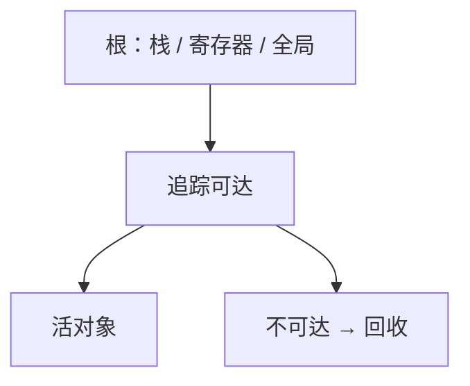

# 运行时与 GC 直觉

语言运行时管理栈上的帧之外的堆；垃圾回收从根出发标记仍可达的对象，其余当作可回收。

<footer>—— 据 McCarthy, Recursive Functions of Symbolic Expressions, 1960；Jones, Hosking and Moss, The Garbage Collection Handbook 整理</footer>

上一课[加载与动态链接](/cs/load-dynlink)让映像进了地址空间。本课不重写 GOT。缺口是：程序还要**分配**生命周期超出当前调用的对象。C 把责任交给 `malloc`/`free`；带 GC 的语言在运行时里藏一套堆。本课只给标记-清扫的直觉，作为编译课程的收束；操作系统课从内核与用户态再剖进程。

## 问题

[栈](/cs/calling-convention-stack)随调用生灭，放不下任意寿命的对象。堆：运行时向操作系统要一大块（后课 `mmap`），再切成对象。手工释放会悬空与泄漏。GC：程序员不写 `free`，运行时找「从根走指针到不了」的块。根：寄存器、栈上的指针槽、全局。编译器必须让 GC 能认指针——栈图、或保守把像指针的字都当根。

缺口是这套分工，不是 JVM 规范全文。

### GC 不是「无限内存」

回收有暂停、有碎片、有与写屏障相关的吞吐代价。实时性与尾延迟是边界。本课只钉可达性 = 活；循环引用在追踪式 GC 下可收，引用计数单独处理循环。

McCarthy 1960 的 Lisp 已用标记回收。Jones 等手册分标记-清扫、复制、分代。本课不把分代写成实现作业。编译栏到堆与根为止，下一课内核/用户态。

## 方法

分配：空闲链表或 bump 指针（复制式）。标记-清扫：从根 DFS/BFS 标记，再扫堆清未标记。复制式：from/to 半区，活对象搬到 to，更新指针。分代：新对象多早死，先扫幼代。

[图的遍历](/cs/bfs-unweighted)在这里作用于堆图。指针必须可识别，否则保守 GC 可能漏收或误钉。

## 机制

编译器为 GC 服务：不把指针藏进非指针表示而不登记；写屏障在分代/增量里通知运行时。无 GC 的语言运行时仍有启动码、异常栈展开、线程局部，本课以堆为中心。ABI 的寄存器在 GC 安全点必须可见——与着色、调用约定一致。

## 边界

本课不写内核分配器、不写页表。不把引用计数算法写完。并发 GC 的漏标问题点名即止。后课操作系统从特权级与进程映像接过「谁给运行时那块虚拟内存」。编译课程到此：从源字符串到带堆的可执行运行时。

后课默认：用户态运行时管理堆；GC 按可达性回收。内核与用户态是下一课程的第一课。

## 小结

- 运行时在栈外提供堆；GC 按根的可达性回收。
- 标记-清扫与复制是基本图像；分代是启发式。
- 编译器须配合根与指针表示。
- 出处：McCarthy, 1960；Jones, Hosking and Moss, *The Garbage Collection Handbook*。
