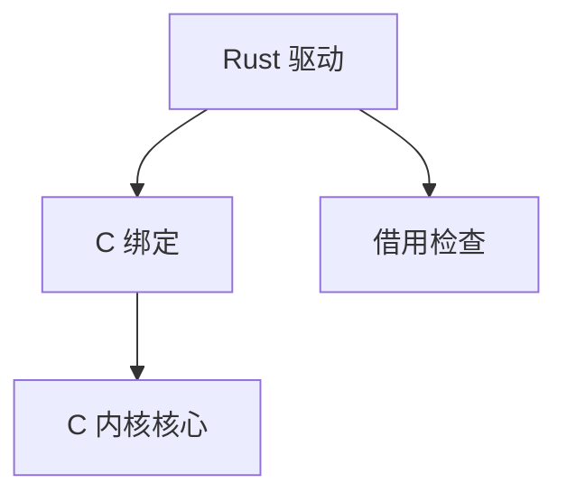

# Rust in kernel

Linux 允许用 Rust 写部分驱动与子系统：借用检查在编译期排除一类空间错误，FFI 仍与 C 内核对话，panic 策略必须适合内核。

<footer>—— 据 Linux Rust 文档；[ASan](/cs/asan-mechanism) 与 [MTE](/cs/memory-tagging) 为运行时对照；[kABI](/cs/kabi-module-signing) 为绑定</footer>

[外核](/cs/exokernel-libos) 改架构。缺口是 **在宏内核里换语言**：Rust for Linux，不是用户态 tokio。

## 问题

C 驱动 UAF 是 CVE 大户。Rust 模块：安全子集 + `unsafe` 包 C API。缺口：bindings 生成；无标准堆 panic；与 [livepatch](/cs/livepatch) 不成熟。本课不把所有 kernel crate 列出。

目标不是用 Rust 重写核心调度。对象是新驱动的记忆安全默认。

## 方法

kbuild 调 rustc → `.ko` 或内建。对照 [KASAN](/cs/asan-mechanism)：动态 vs 静态。对照 seL4：证明 vs 类型。对照 [ioctl](/cs/chardev-ioctl)：仍要定义 ABI。

## 机制

Rust in kernel 把一类内存安全从审查移到编译器，不消除逻辑 bug 与 `unsafe`。它改变新代码的默认质量。不要写成语言战争。与 [Secure Boot](/cs/secure-boot)：模块仍要签名。与 [eBPF](/cs/ebpf-observability)：BPF 已是另一条安全沙箱路径。

工具链版本与内核树绑定是运维税。

实现上：bindings 由脚本从 C 头生成，C 改布局就破。内核禁止普通 Rust 栈展开 panic。unsafe 块仍要人工审，类型系统不审 DMA 别名。 读法上只引用[上一课](/cs/exokernel-libos)的结论，不把对象换成训练推理或限价簿。

本课在操作系统进阶的「虚拟化与隔离进阶 / 容器与内核形态」课序里，对象是 **Rust in kernel**。

- 先修只引用，不重导：上一课的结论当公理，本课只补差。
- 五栏不吞并：不把本课写成大模型训练/推理，也不写成限价簿或权重量化。
- 文献用 OSTEP、McKusick、内核文档与具名会议论文；不发明 arXiv 编号。

## 边界

本课不引入所有 `unsafe` 指南。不保证实时路径用 Rust。下一课对照另一宏内核：Windows NT。

版本字段会变，课序钉的是机制对象「Rust in kernel」，不是某一主线内核的结构体名。
后课默认：新驱动可用 Rust 绑进 Linux。NT 内核对象模型对照，下一课。

## 小结

- Rust 模块用类型系统减空间错误，经 FFI 调 C。
- 不替换整个内核；panic 与分配器要特化。
- Windows NT 对照是下一课。
- 出处：Linux rust；kbuild；内存安全课先修。
