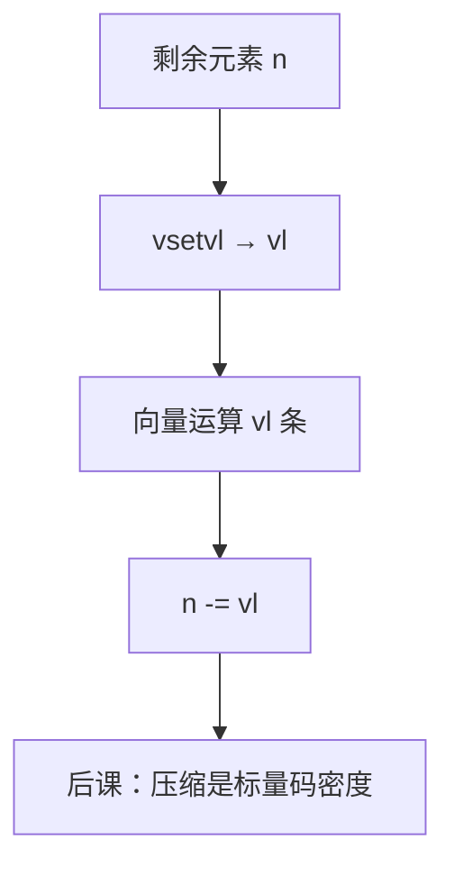

# RISC-V 向量扩展 RVV

  
向量长度寄存器让同一条指令在不同实现上打不同条数：软件按 `vl` 剥循环，硬件用自己的 VLEN 切条，不必为 128/256/512 各写一遍。

  <footer>—— 据 RISC-V Vector Extension Specification；Hennessy and Patterson, CA:AQA 整理</footer>

[上一课](/cs/simd-extensions)的 AVX 宽度写进 ISA 分代。缺口是 **RVV**：`vsetvl` 设定本次 `vl`，寄存器是向量寄存器组，实现选定 VLEN。与 Cray 风格向量更近，与定宽 NEON 对照。

## 问题

可移植二进制：同一 `vadd.vv` 在 VLEN=128 与 512 的核上都能跑，软件用 strip-mining 循环 `vl = vsetvl(n)`。缺口不是再解释 DLP，而是这套 **配置**：SEW（元素宽）、LMUL（寄存器分组）、掩码寄存器 `v0`。内存：unit-stride、strided、indexed（gather/scatter）。

尾与掩码：`vta`/`vma` 策略决定未用元素是否保留——向量谓词，后课条件码再对照标量谓词。

### RVV 不是「RISC-V 的 AVX-512」

没有强制 512 位。把 RVV 当某代 Intel 宽度的克隆，可移植性故事会破。也不把 RVV 写成训练框架的自动代码生成目标——本栏停在 ISA。

RISC-V Vector Spec 是权威。CA:AQA 向量机章节给直觉。本课不背全部向量指令 opcode。

## 方法

循环：测剩余 `n`，`vsetvl`，向量 load/运算/store，指针与 `n` 递减。异常：向量访存的页故障元素位置要精确或按规范重启，实现复杂——点名。与 [fence](/cs/fence-instructions)：向量访存参与同一内存模型。

DSP 定点：RVV 有整数与饱和变体，对应饱和课。FMA 有向量版。

## 机制

压缩指令减少标量循环开销，与 RVV 叠用。页表走访仍是标量特权机制；向量 load 只是多次翻译或页跨越处理。本课钉「可变 VL」这一 RISC-V 选择。

## 边界

本课不保证某开源核的 VLEN，不写矩阵扩展（RVV 之外）。不把 autovectorizer bug 当 ISA 定义。

后课默认：RVV 用 `vl` 与 VLEN 解耦软件与实现宽度；循环靠 strip-mining。

## 小结

- `vsetvl` 设定本次元素数；实现选 VLEN。
- 不是定宽 AVX 的改名。
- 掩码与尾策略处理短尾与条件。
- 出处：RISC-V Vector Extension Spec；Hennessy and Patterson, CA:AQA。
