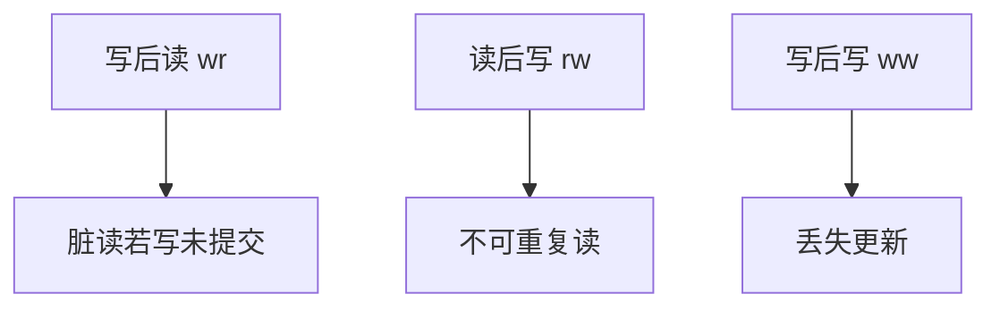

# 前向与后向冲突

读写、写读、写写是三种冲突；图上的边方向记录「谁先」，环意味着无法对应任何串行序。

<footer>—— 据 Eswaran et al., 1976；Bernstein, Hadzilacos and Goodman 对冲突的整理</footer>

[上一课](/cs/conflict-serializable)用冲突图无环定义合法交错。本课不重讲「交换非冲突操作」。缺口是边的种类：rw（读后写）、wr（写后读）、ww（写后写）在隔离异常里名字不同——脏读、不可重复读、丢失更新。后课 2PL 要锁的正是这些边。

## 问题

冲突可串行留下「冲突」。若不分类，锁协议不知道该用共享还是互斥。同一数据项上：wr 边表示后者读到前者的写；rw 表示后者的写使前者的读不能换到后面；ww 是覆盖。缺口是**把图的边写成三种依赖**，对应后课异常名。

前向/后向常相对某一串行序而言：边指向「应该更晚」的事务。本课用 rw/wr/ww 记号，避免和编译课数据依赖术语缠在一起。

## 方法

从调度抽出三元组（事务，对象，读或写），按时间相邻且不可交换则加边。只读事务之间无边。谓词读（范围）的冲突对象是集合，幻象下一单元再展开。本课对象先当点项。

## 机制

三种边给锁管理器分工：读加共享挡住 ww/rw 里写者，写加互斥挡住一切。图有环则不存在相容串行序，必须在运行时避免产生环，而不是事后画图。恢复：wr 若来自未提交写，回滚会级联——严格 2PL 后课切掉。

## 边界

本课不把快照隔离的写集冲突提前。运行时如何只产生无环调度，下一课两阶段锁。

后课默认：隔离要管 rw、wr、ww。协议是 2PL。

## 小结

- 冲突分 wr、rw、ww，对应不同异常。
- 环 = 非冲突可串行。
- 两阶段锁下一课。
- 出处：Eswaran 1976；Bernstein 等。
