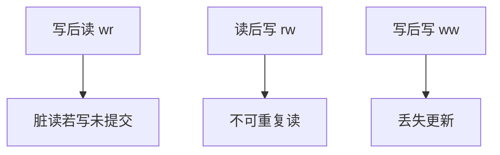
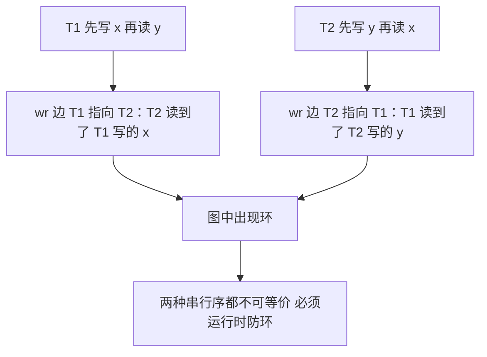

# 前向与后向冲突

读写、写读、写写是三种冲突；图上的边方向记录「谁先」，环意味着无法对应任何串行序。

<footer>—— 据 Eswaran et al., 1976；Bernstein, Hadzilacos and Goodman 对冲突的整理</footer>

[上一课](/cs/conflict-serializable)用冲突图无环定义合法交错。本课不重讲「交换非冲突操作」。缺口是边的种类：rw（读后写）、wr（写后读）、ww（写后写）在隔离异常里名字不同——脏读、不可重复读、丢失更新。后课 2PL 要锁的正是这些边。

## 问题

冲突可串行留下「冲突」。若不分类，锁协议不知道该用共享还是互斥。同一数据项上：wr 边表示后者读到前者的写；rw 表示后者的写使前者的读不能换到后面；ww 是覆盖。缺口是**把图的边写成三种依赖**，对应后课异常名。术语翻译：冲突图的「边」就是用「箭头记下『这件事被迫排在另一件之后』」的手段来做「把交错调度翻译成一张谁先谁后的偏好图」的事；两个箭头顶头成环，就说明两边互不相让，谁也没法整体排到前面。

前向/后向常相对某一串行序而言：边指向「应该更晚」的事务。本课用 rw/wr/ww 记号，避免和编译课数据依赖术语缠在一起。

## 方法

从调度抽出三元组（事务，对象，读或写），按时间相邻且不可交换则加边。只读事务之间无边。谓词读（范围）的冲突对象是集合，幻象下一单元再展开。本课对象先当点项。数字实例：同一个对象 x，读写顺序组合决定边的种类——`W1(x) R2(x)` 抽出 wr 边 T1→T2；`R1(x) W2(x)` 抽出 rw 边 T1→T2；`W1(x) W2(x)` 抽出 ww 边 T1→T2。只读事务互相之间，一条边都抽不出来。

```mermaid
flowchart TD
  WR["写后读 wr"] --> DIRTY["脏读若写未提交"]
  RW["读后写 rw"] --> UNREP["不可重复读"]
  WW["写后写 ww"] --> LOST["丢失更新"]
```

## 机制

三种边给锁管理器分工：读加共享挡住 ww/rw 里写者，写加互斥挡住一切。图有环则不存在相容串行序，必须在运行时避免产生环，而不是事后画图。恢复：wr 若来自未提交写，回滚会级联——严格 2PL 后课切掉。常见误区：初学者容易以为「先跑完再查图、有环就回滚」是数据库的常规做法——真实系统是在运行时用锁（下一课 2PL）让环压根生不出来；冲突图是事后分析「这个交错为什么不合法」的工具，不是运行时兜底。

```mermaid
flowchart TD
  T1A["T1 先写 x 再读 y"] --> E1["wr 边 T1 指向 T2：T2 读到了 T1 写的 x"]
  T2A["T2 先写 y 再读 x"] --> E2["wr 边 T2 指向 T1：T1 读到了 T2 写的 y"]
  E1 --> CYC["图中出现环"]
  E2 --> CYC
  CYC --> NO["两种串行序都不可等价 必须运行时防环"]
```

## 边界

本课不把快照隔离的写集冲突提前。运行时如何只产生无环调度，下一课两阶段锁。

后课默认：隔离要管 rw、wr、ww。协议是 2PL。

## 小结

- 冲突分 wr、rw、ww，对应不同异常。
- 环 = 非冲突可串行。
- 两阶段锁下一课。
- 出处：Eswaran 1976；Bernstein 等。
