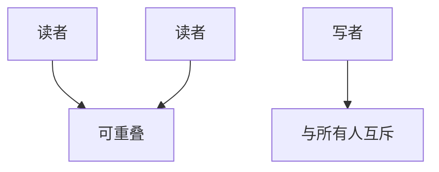

# 读写锁

读者与读者可以重叠；写者与任何人互斥。读多写少时它比一把 mutex 更松，写者却可能被源源不断的读者挡住。

<footer>—— 据 Silberschatz et al., Operating System Concepts；Love, LKD 整理</footer>

[上一课](/cs/futex)让互斥可以很便宜。许多内核结构（路由表、挂载表）读远多于写：读者彼此不破坏不变量。缺口是 **rwlock**：共享读、排他写。本课钉语义与写者饥饿，不把 seqlock、RCU 写完。

## 问题

mutex 把读者也串行化，吞吐被锁字卡住。[临界区](/cs/race-critical) 的不变量若只被写者打破，读者重叠是安全的。实现：计数「当前读者」或用状态字的读计数+写标志，获取时原子更新。写者等到计数为零。缺口不是 futex 的 wait 机制（可以建在它或自旋上），而是这套**兼容性矩阵**。

写者饥饿：读者不断进场，计数永不归零。对策是写者到达后阻挡新读者，或改用 seqlock/RCU。

## 方法

`read_lock`：若无写者则读者计数加一。`write_lock`：等无读者无写者。IRQ 版同样要标明能否在硬中断里读。睡眠版 rwsem：等待者可睡，规则同 mutex——禁止 IRQ。公平策略：写者等待时新读者是否允许，本课要求说清楚，默认承认存在饥饿模式。

升级（持读再要写）易死锁：另一读者同样升级。主干禁止隐式升级。

## 机制

rwlock 提高读侧并行，写侧延迟变差。与[调度](/cs/scheduling-metrics)：一长串读者会把写者的等待做成饥饿，公平尺子坏掉。缓存上，读计数仍是共享行，读者多时也会乒乓——这把后课 seqlock（读侧几乎不写共享行）和 RCU 的动机钉住。

## 边界

本课不把 Linux `rwlock_t` 与 `rw_semaphore` 的全部 API 对照完。也不把数据库里的意向锁混进来。seqlock 用版本号让读者无锁重试，下一课。

后课默认：读可重叠、写排他，写者可能饿。读侧几乎不写锁字的版本号方案，下一课 seqlock。

## 小结

- rwlock：读者共享、写者排他；写者可被读者流饿死。
- 不可随意读升级为写。
- 版本号无锁读是下一课。
- 出处：Silberschatz et al., *OSC*；Love, *LKD*。
