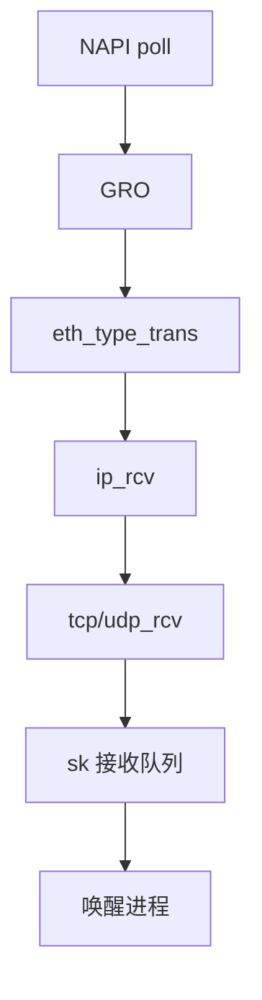

# 接收路径

一帧从 NAPI 进入协议钩子：以太网 → IP → L4，再由套接字查找把 sk_buff 挂进接收队列，唤醒读者。

<footer>—— 据 Benvenuti, <em>ULNI</em>；Linux 对 netif_receive_skb 之后路径的文档</footer>

[GRO](/cs/gro-gso) 把 skb 交给 `netif_receive_skb`。缺口是 **整条 RX**：ptype 分发、iptables 前半、路由、TCP 输入、直到 `sk_data_ready`。本课串路径，不把 TCP 拥塞算法写完。

## 问题

驱动不知哪个进程要这包。内核：根据以太网类型找 `packet_type`，IP 查 fib，再 `tcp_v4_rcv` 用四元组找 `sock`。无套接字则 drop 或 ICMP。缺口：early demux、RPS/RFS 把包steer到 CPU；[netfilter](/cs/netfilter-conntrack) 钩子插在 PREROUTING/INPUT；用户未 `read` 则队列有上限，超则丢——背压后课。本课不把 XDP 的先发制人展开，只承认它可在 NAPI 更早 drop/redirect。

busy poll 时用户线程可能自己把包从队列取走。抓包 AF_PACKET 在 ptype 上再挂一个处理者。

## 方法

`netif_receive_skb` → ingress qdisc（可选）→ `ip_rcv` → netfilter → `ip_local_deliver` → L4。TCP：状态机、缓冲、ACK。对照存储 RX：没有「文件偏移」，只有端口与地址。对照 [设备节点](/cs/device-nodes)：`/dev/net/tun` 会在这条路径中途插入。

## 机制

RX 路径是「把 DMA 来的字节变成进程可读缓冲」的编译结果：每层剥头，最后是 socket buffer。性能问题几乎都是：几次缓存未命中、几次锁、是否跨 NUMA。不要写成七层 OSI 教材重开——对象是 Linux 函数链。

与 [NFS](/cs/nfs-semantics)：NFS 只是这路径上的一种 L4 负载。

实现上：early demux 用缓存的 sock 跳过一次查找。socket filter 与 tc ingress 可在协议层前丢包。无套接字的 TCP 段走 RST 或静默丢，取决于状态。 读法上只引用[上一课](/cs/gro-gso)的结论，不把对象换成训练推理或限价簿。

本课在操作系统进阶的「网络栈 / 收发路径」课序里，对象是 **接收路径**。

- 先修只引用，不重导：上一课的结论当公理，本课只补差。
- 五栏不吞并：不把本课写成大模型训练/推理，也不写成限价簿或权重量化。
- 文献用 OSTEP、McKusick、内核文档与具名会议论文；不发明 arXiv 编号。

## 边界

本课不引入 IPv6 扩展头的全部处理。不保证转发路径（不是本机交付）的每一跳设备。下一课对侧：从 `sendmsg` 到网卡的 TX 与 qdisc。

版本字段会变，课序钉的是机制对象「接收路径」，不是某一主线内核的结构体名。
后课默认：包经协议栈进入 sk 队列。发送如何排队整形，下一课 TX/qdisc。

## 小结

- RX：NAPI → 协议分发 → 套接字队列 → 唤醒。
- netfilter 与 RPS 插在这条链上。
- 发送路径与 qdisc 是下一课。
- 出处：Benvenuti *ULNI*；Linux net/core；Stevens。
