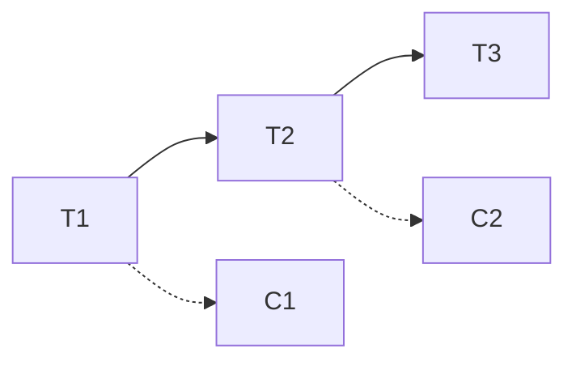

# Saga

长事务拆成一串本地事务，每步有补偿。不阻塞资源到结束，也不给全局原子：中间状态可见，补偿可能失败。

<footer>—— 据 Garcia-Molina and Salem, Sagas, SIGMOD 1987 整理</footer>

上一课[幂等键](/cs/idempotency-keys)盖住单步骤重试。缺口是**跨服务的一长串写**：2PC 会把锁或连接占太久，且协调者脆。[共识与 2PC](/cs/consensus-vs-2pc)已说明阻塞。Saga 用补偿换非阻塞，规格弱于原子提交。后课日志是实现编排的一种总线，不是 Saga 理论本身。

## 问题

Garcia-Molina–Salem：saga = $T_1 C_1 T_2 C_2 \ldots T_n$，每个 $T_i$ 是本地事务，$C_i$ 补偿 $T_i$。正向全成或补偿已执行前缀。隔离：saga 之间可以看见彼此的中间 $T_i$——这是相对 ACID 长事务的故意放松。

缺口：补偿不是回滚日志自动生成。订票补偿是退票，可能退不了，要人工。补偿也要幂等。编排（中心状态机）与协同（各步发事件）是实现拓扑。

1987 论文在单库长事务语境；微服务把它搬到跨进程。规格没变：可见中间态 + 补偿。

## 方法

每步：本地事务 + 幂等键 + 写「saga 日志」（自身 RSM 或 DB 行）标记进度。失败：对已完成前缀逆序 $C_i$。$C_i$ 失败：重试或进死信，saga 停在部分补偿——这是规格允许的坑，必须可观测。

不要用 Saga 实现转账的强不变式「永不丢钱」而不另加账本对账：中间与补偿窗口里钱在路上。

## 机制

与 2PC：2PC 准备态对外不可见（理想）；Saga 的 $T_i$ 已提交，对外可见。与 RSM：可用状态机编排 saga，每转换一条日志，崩溃可恢复——恢复的是编排状态，不是把 $T_i$ 变未提交。

本课不把 BPMN 引擎当定理。也不写限价簿成交链。

并发：两个 saga 改同一账户，补偿与正向交错，需要业务层锁或版本，否则补偿打到别人的后续写上。这是 1987 已点的隔离弱点。

## 边界

本课不列补偿模式目录（retry、cancel、undo）。不引入 TCC 的 Try-Confirm 作为新理论，只点名它更接近 2PC 的资源预留。后课默认：跨服务长流程用 Saga 则接受中间可见与补偿失败路径；要原子用短 2PC 或单 RSM。Kafka 下一课提供事件序，不自动给补偿。

放松隔离是为了不阻塞。买回来的是运维与对账义务。

## 小结

- Saga：本地事务序列 + 补偿；中间态可见。
- 补偿必须幂等且可观测失败。
- 不替代 2PC 的原子；不替代幂等键的单步去重。
- 出处：Garcia-Molina and Salem, SIGMOD 1987。
