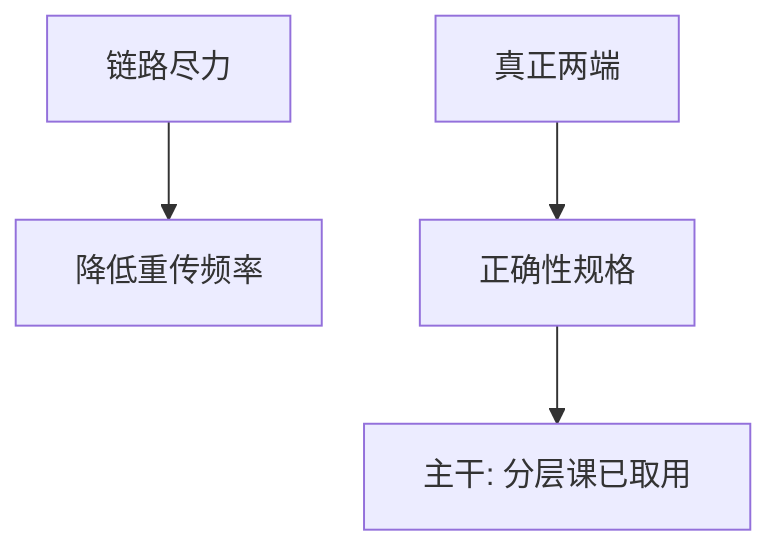

# Saltzer 端到端

功能只应放在端系统能完成且正确的那一层；下层的「几乎正确」不能代替两端的检查。

<footer>—— Saltzer, Reed and Clark, End-to-End Arguments in System Design, ACM TOCS 1984</footer>

[上一课](/cs/cerf-kahn-tcp)附录对照了 1974 年互联与可靠流设想。附录对照，不插入主干。主干已在[分层与端到端](/cs/layering-e2e)用文件传送例子钉死论证，并在 CRC、TCP 校验、TLS 入口反复引用；这里对照 **1984 原文的问题**：在已有互联的世界上，可靠性、加密、去重该放哪一层。不重画五层图，也不把本篇插回 DMA 之后当第一课网络。

## 问题

Cerf–Kahn 给出网关与主机协议。Saltzer 等的缺口是设计原则：链路重传挡不住中间内存出错，文件正确性只能在真正读写文件的两端用校验与重试保证。下层努力是性能。原文还谈加密与交付保证的同类结构。主干分层课已经取走这一句；附录对照原文如何用反例把原则写硬。

论证不是「不要 CRC」。主干[CRC 在帧上](/cs/frame-crc) 明确：一跳检错降端到端重传频率。反对的是声称下层已经够了。

## 方法

举文件传送、加密只在链路时换跳即明文、重复报文在中间去重仍可能在端点重复。结论：端到端能做对的功能，规格必须在端。主干[TLS](/cs/tls-handshake) 把机密性放到会话两端，正是这条原则在安全课的实例。

## 机制

原则约束层间合同，使后课不会把 FCS 当成文件完整性，也不会把防火墙当成 TLS。它与 Lampson 矩阵正交：一个谈放哪一层，一个谈谁有权。Codd 下一篇把数据从指针网里抽出来，对象又换。

### 为何对照而不插入主干

主干网络第一课必须接 OS 的 DMA 缺口，用教学五层往下走进帧。把 1984 插在 Cerf–Kahn 之后当课序，读者会以为先读论文再碰 MAC。本栏已在分层课取用原则；附录只对照原文论证，不改变「帧在 IP 前」的课序。

## 边界

不要把端到端与网络中立政策混成一篇。也不要在附录里开主动网络。下一篇对照 Codd 1970 关系模型。

对照结束应回到主干[分层与端到端](/cs/layering-e2e)。1984 文不插入 virtio 与帧之间。

## 小结

- 附录对照 Saltzer, Reed and Clark 1984：正确性在真正两端。
- 主干分层课已取用；本篇不插入网络课序。
- 出处：Saltzer, Reed and Clark, *ACM TOCS* 1984。
