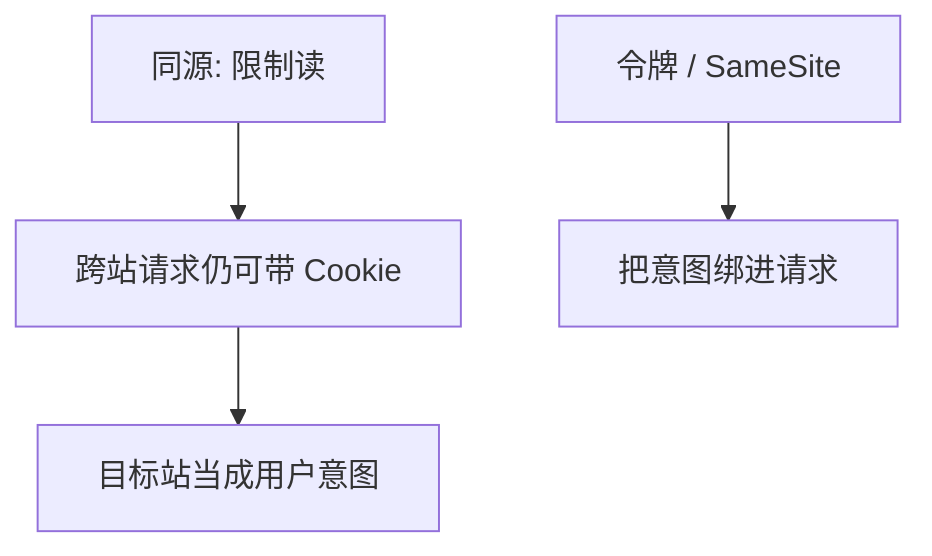

# 同源与 CSRF

浏览器按源隔离脚本能读的数据；跨站请求仍会自动带上用户的 Cookie，于是「谁在发」与「谁想发」可以分开。

<footer>—— 据浏览器同源政策；Anderson 对混淆代理人；RFC 9110 的 Cookie 对照</footer>

[上一课](/cs/dos-amplify)处理可用性上的洪水与放大。本课不重做放大因子。缺口是 Web 客户端：同源政策（SOP）挡住读，挡不住浏览器对另一站自动出示凭证。CSRF：外站诱导浏览器对目标站发带身份的请求。防御是分离「浏览器已登录」与「用户意图」。注入下一课是解释器边界。

## 问题

DoS 课打 A。Web 应用还把会话放在 Cookie。SOP：不同源的脚本不能读对方 DOM 与多数响应。表单与部分请求仍可跨源发出，Cookie 默认随行——这是混淆代理人：浏览器是用户的代理人，却被另一源驱使。缺口是**同源只管机密性读取，不管跨站写请求**。本课不给诱骗页面配方。

SameSite Cookie、反 CSRF 令牌、要求自定义头，都是把「有意图」绑进请求。CORS 是读响应的放行名单，不是 CSRF 的完整解。

## 方法

防御合同：状态改变用非简单请求或带不可预测令牌；Cookie 设 SameSite；关键操作再认证。SOP 仍是读隔离的基石。本课只讲机制：自动凭证 + 跨站发出 = 意图缺失。

## 机制

CSRF 不需要读出 Cookie 值，只要让浏览器发出去——因此只加密（TLS）不够，中间人课的认证也不自动修。它与[OAuth](/cs/oauth-oidc) 的 redirect 风险同构：代理人被第三方利用。最小特权：会话 Cookie 不要过宽路径。

## 边界

本课不把 XSS 与 CSRF 混成一课；脚本注入是下一课解释器边界。也不把全部 CORS 头当百科。

后课默认：跨站请求不等于用户意图。不可信字符串进入解释器是另一边界。

## 小结

- SOP 隔离读；CSRF 利用自动凭证发写请求。
- 防御是意图绑定，不是再加一层 TLS。
- 注入作为输入边界下一课。
- 出处：同源政策；Anderson；对照 RFC 9110。
