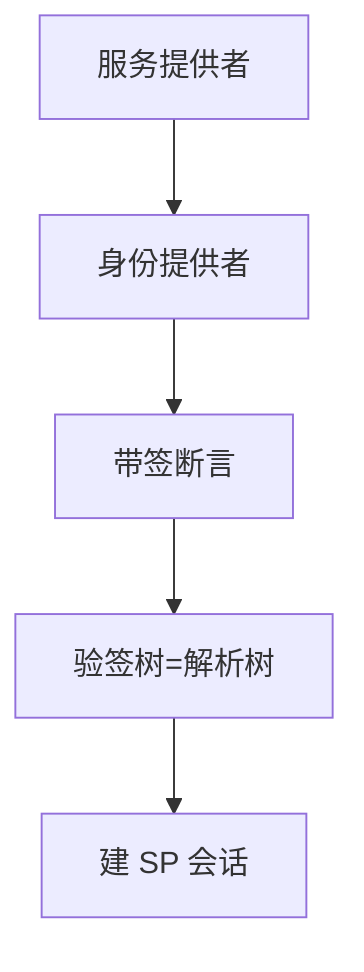

# SAML

SAML 用 XML 断言在身份提供者与服务提供者之间搬家。签名包络、受众、时间窗与「谁解析 XML」决定断言是否可被换皮。

<footer>—— OASIS SAML 2.0；对照 RFC 7522 等承载轮廓；Gross 与 Pfitzmann 对联邦的讨论</footer>

## 定位

上一课[OAuth](/cs/oauth-attack-surface)是 JSON/REST 联邦的近亲。缺口是**企业 SSO 仍大量走 SAML**：浏览器 POST 断言。本课收验证合同，不给 XML 包装攻击的操作步骤。

后课默认已经读完本课钉下的合同，只补差，不从该领域第一性原理重开。

## 问题

签名不覆盖被解析的那块、允许外部实体、受众为空、时钟窗过大、SP 不验 `InResponseTo`。缺口是 XML 安全与断言语义，不是再讲联邦单点登录的商业故事。

### 与 OIDC 并存

同一组织可两套 IdP。应用应钉一种验证库，不要「有断言就信」。

SAML 2.0 Core。XML 数字签名与包装是经典失败模式——只陈述「验签树必须等于解析树」。本课禁止利用指导。

## 方法

画 SP 发起 SSO：Redirect 到 IdP，回来 POST 断言。列出必验：签名、Issuer、Audience、条件时间、Subject。对照 JWT：同是声明，编码不同。

图中节点是本课的机制骨架；课程不把图展开成可运行的攻击步骤。

## 机制

联邦把口令从 SP 拿走，把 TCB 换成 IdP 与 XML 栈。下一课 WebAuthn：把密钥放到认证器，减少共享口令与断言解析面。

前提写进合同之后，游戏外的误用只当失败模式点名，不在本课写成操作程序。

## 边界

本课不写全部 Bindings。WebAuthn/FIDO2 下一课。

## 小结

- OAuth 之后，SAML 是 XML 断言联邦。
- 签名覆盖必须对准实际解析的断言。
- 受众与时间窗不可空转。
- 下一课 WebAuthn / FIDO2。
- 出处：OASIS SAML 2.0；对照 OWASP 对 SAML 的讨论；Anderson。
