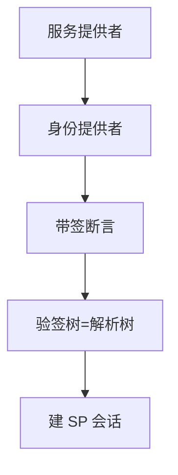

# SAML

SAML 用 XML 断言在身份提供者与服务提供者之间搬家。签名包络、受众、时间窗与「谁解析 XML」决定断言是否可被换皮。

<footer>—— OASIS SAML 2.0；对照 RFC 7522 等承载轮廓；Gross 与 Pfitzmann 对联邦的讨论</footer>

上一课[OAuth](/cs/oauth-attack-surface)是 JSON/REST 世界的联邦近亲。缺口是**企业 SSO 仍大量走 SAML**：浏览器 POST 一份 XML 断言回来。本课收验证合同——收到断言后必须检查什么，不给 XML 包装攻击的操作步骤。

后课默认已经读完本课钉下的合同，只补差，不从该领域第一性原理重开。

## 问题

经典失败清单：签名验证的不是被解析使用的那一块（XML 包装）；解析器允许外部实体（XXE）；Audience 为空或过宽，断言被任何 SP 换皮重用；时钟窗过大，过期断言长命；SP 不验 `InResponseTo`，响应可被注入别的会话。缺口是 XML 安全与断言语义两层都要收紧，不是再讲联邦单点登录的商业故事。

### 与 OIDC 并存

同一组织常常 SAML 与 OIDC 并存，甚至两套 IdP。应用要钉死一种验证库与一套配置，所有断言走同一校验路径；「收到断言就建会话」等价于不设防。

SAML 2.0 Core。XML 数字签名与包装是经典失败模式——只陈述「验签树必须等于解析树」。本课禁止利用指导。

## 方法

SP 发起的流程：SP 把用户 Redirect 到 IdP，IdP 认证后让浏览器 POST 签名断言回来。必验清单固定五项：签名且验签树等于解析树、Issuer 是已知 IdP、Audience 是本 SP、Conditions 时间窗有效、Subject 与 `InResponseTo` 对得上本会话。对照 JWT：同是声明集合，编码与信任解析不同。

```mermaid
flowchart TD
  SP["服务提供者"] --> IDP["身份提供者"]
  IDP --> ASS["带签断言"]
  ASS --> V["验签树=解析树"]
  V --> SESS["建 SP 会话"]
```

## 机制

机制上，联邦把用户口令从各 SP 拿走、集中到 IdP，但 TCB 没有变小，只是换成了 IdP 加整个 XML 签名解析栈：口令泄漏面缩小，断言伪造面换了个位置，验证合同因此要逐项钉死。下一课 WebAuthn：把密钥放到认证器，减少共享口令与断言解析面。

## 边界

本课不写全部 Bindings，Artifact、SOAP 等从略。WebAuthn/FIDO2 下一课。

## 小结

- OAuth 之外，SAML 是企业 SSO 常用的 XML 断言联邦。
- 签名覆盖必须对准实际解析的断言，验签树等于解析树。
- 受众与时间窗不可空转，`InResponseTo` 要回对会话。
- 下一课 WebAuthn / FIDO2。
- 出处：OASIS SAML 2.0；对照 OWASP 对 SAML 的讨论；Anderson。
