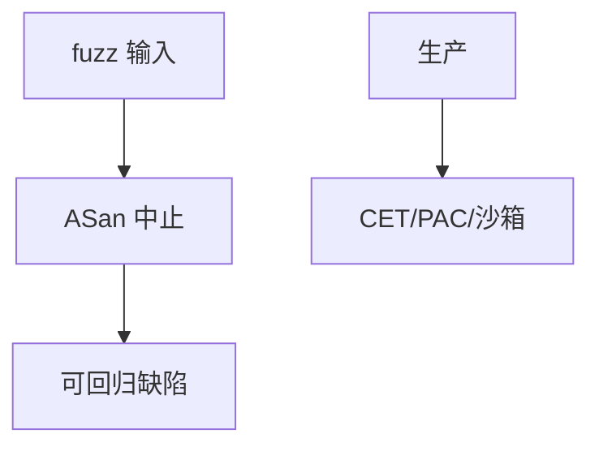

# Sanitizers

ASan 在影子内存里记账，越界与 UAF 变成立即中止；UBSan 抓未定义；MSan 抓未初始化。它们是测试时的预言，不是生产默认的零开销证明。

<footer>—— Serebryany et al., AddressSanitizer, USENIX ATC 2012；对照 LLVM sanitizer 文档</footer>

## 定位

上一课[污点](/cs/static-taint-analysis)是流规则。缺口是**把空间错误变成确定崩溃**，好让 fuzz 停下来。本课收 ASan/MSan/UBSan/TSan 的分工，不讲如何绕过 ASan。

后课默认已经读完本课钉下的合同，只补差，不从该领域第一性原理重开。

## 问题

无 sanitizer 时溢出可能「看起来能跑」。ASan：红区与延迟释放。TSan：数据竞争。缺口是：要进 CI；生产用不同工具（GWP-ASan 抽样点名）。

### 性能

完整 ASan 不宜当默认生产配置。发现阶段与发布阶段分开。

Serebryany et al. 2012。本课禁止利用未开 sanitizer 的差异写 exploit。

## 方法

表状叙述四种。要求 fuzz 目标链 ASan。对照硬件缓解：一边发现，一边上线硬化。下一课浏览器沙箱：即使有洞也难出进程。

图中节点是本课的机制骨架；课程不把图展开成可运行的攻击步骤。

## 机制

发现课把洞变成票。沙箱下一课把爆炸半径从「全用户」收到「渲染进程」。

前提写进合同之后，游戏外的误用只当失败模式点名，不在本课写成操作程序。

## 边界

本课不写关闭 ASan 的技巧。浏览器沙箱下一课。

## 小结

- 污点是流；sanitizer 是空间/并发预言。
- fuzz 应开 ASan；生产靠缓解与抽样。
- 立即中止优于静默损坏。
- 下一课浏览器沙箱。
- 出处：Serebryany et al., ATC 2012；LLVM Sanitizers。
