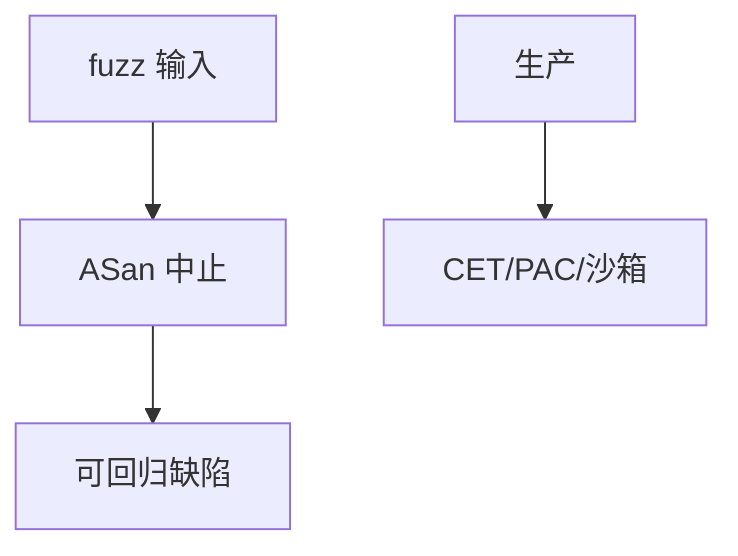
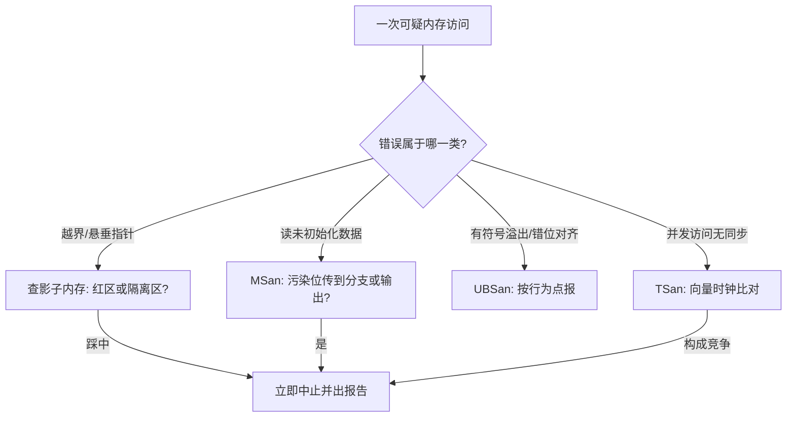

# Sanitizers

ASan 在影子内存里记账，越界与 UAF 变成立即中止；UBSan 抓未定义；MSan 抓未初始化。它们是测试时的预言，不是生产默认的零开销证明。

<footer>—— Serebryany et al., AddressSanitizer, USENIX ATC 2012；对照 LLVM sanitizer 文档</footer>

上一课[污点](/cs/static-taint-analysis)是编译期的流规则，静态回答「数据从哪来」。缺口是**把空间错误变成确定崩溃**，好让 fuzz 停下来。本课收 ASan/MSan/UBSan/TSan 的分工，不讲如何绕过 ASan。

后课默认已经读完本课钉下的合同，只补差，不从该领域第一性原理重开。

## 问题

无 sanitizer 时，堆溢出可能「看起来能跑」：越界写的字节恰好落在没人用的填充里，缺陷静默潜伏到生产才爆。ASan 的思路是把侥幸变成必然崩溃：每次堆分配周围涂红区，访问内存前查影子内存——按 1 字节影子记录 8 字节真实内存的辅助地址空间——落在红区即中止；延迟释放把刚 free 的块隔离一阵，再访问即判 UAF。TSan 对每次访问维护向量时钟，无同步关系的并发访问同一位置即报数据竞争；MSan 跟踪未初始化位，直到它影响分支或输出。缺口是把这些放进 CI；生产用不同工具（GWP-ASan 抽样点名）。

### 性能

完整 ASan 运行慢约一倍、内存开销也翻倍，不宜当默认生产配置。发现阶段与发布阶段分开：测试开全套抓 bug，生产靠缓解与抽样兜底。

Serebryany et al. 2012。本课禁止利用未开 sanitizer 的差异写 exploit。

数字实例：ASan 按 1 字节影子记录 8 字节真实内存，程序访问 8 GB 堆约需 1 GB 影子表，这解释了「内存开销翻倍」从哪来；红区通常再垫几十字节，越界写偏 1 字节也会踩中涂色区。

直觉类比：影子内存像仓库门口的平面图——每次搬东西前先对图看一眼「这个格子归谁」。图上标红的过道、标灰的已退租格，一碰就当场报警，而不是等账目年底对不上才发现货被人动过。

常见误区：初学者容易以为「程序没崩就说明越界写没事」。实际上越界字节常落在堆块间的填充里，把后面的变量悄悄改掉——ASan 的价值正是把这种静默损坏提前换成必现崩溃。

## 方法

四种工具按错误类别分工：ASan 管空间——越界与 UAF；MSan 管未初始化；UBSan 管未定义行为——有符号溢出、错位对齐、空引用解引用；TSan 管并发。硬规矩只有一条：fuzz 目标必须链 ASan，否则 fuzz 器对静默越界跑上亿个输入也不会停。对照硬件缓解：一边发现，一边上线硬化，CET/PAC 这类机制接住漏网的。下一课浏览器沙箱：即使有洞也难出进程。

```mermaid
flowchart TD
  FUZZ["fuzz 输入"] --> ASAN["ASan 中止"]
  ASAN --> BUG["可回归缺陷"]
  PROD["生产"] --> MITIG["CET/PAC/沙箱"]
```

## 机制

sanitizer 是测试时的预言：把「未定义」提前钉成确定的中止点，fuzz 于是从「等可观察故障」变成「等第一次违规」，信号密度完全不同。发现课把洞变成票。沙箱下一课把爆炸半径从「全用户」收到「渲染进程」。两者互补：sanitizer 压低进入生产的 bug 数量，缓解与沙箱限制漏网 bug 的后果；前者的失败模式是漏检，后者的失败模式是单个 bug 拿到全部权限。

```mermaid
flowchart TD
  ERR["一次可疑内存访问"] --> KIND{"错误属于哪一类?"}
  KIND -- "越界/悬垂指针" --> ASAN["查影子内存: 红区或隔离区?"]
  ASAN -- "踩中" --> ABORT["立即中止并出报告"]
  KIND -- "读未初始化数据" --> MSAN["MSan: 污染位传到分支或输出?"]
  MSAN -- "是" --> ABORT
  KIND -- "有符号溢出/错位对齐" --> UBSAN["UBSan: 按行为点报"]
  KIND -- "并发访问无同步" --> TSAN["TSan: 向量时钟比对"]
  TSAN -- "构成竞争" --> ABORT
```

这张图回答的问题是：四种 sanitizer 各守哪类错误、各自用什么内部状态下判——影子内存、污染位、行为点、向量时钟，最后都汇到同一个「立即中止」出口。

## 边界

本课不写关闭 ASan 的技巧——生产二进制里关检测属发布工程取舍；也不写绕过红区与影子内存的 exploit 手法。浏览器沙箱下一课。

## 小结

- 污点是流；sanitizer 是空间/并发预言。
- fuzz 应开 ASan；生产靠缓解与抽样。
- 立即中止优于静默损坏。
- 下一课浏览器沙箱。
- 出处：Serebryany et al., ATC 2012；LLVM Sanitizers。
