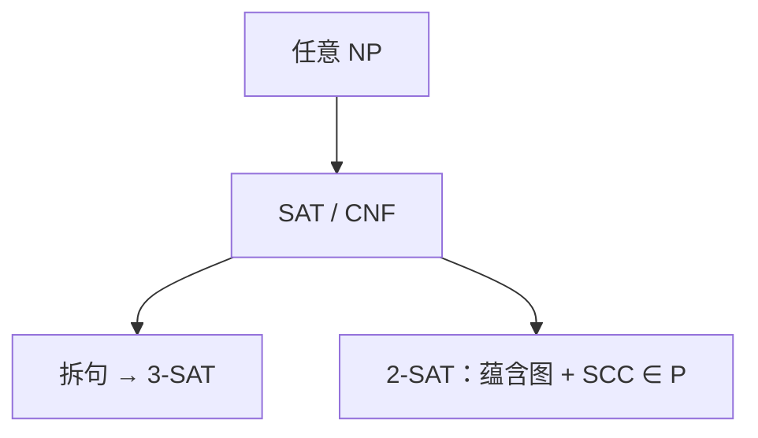

# SAT 与 3-SAT

命题可满足性是 NP 完全的根；每个子句至多三个文字的 3-SAT 仍完全，两个文字的 2-SAT 却在 P。

<footer>—— 据 Cook, The Complexity of Theorem-Proving Procedures, 1971；Levin, 1973；Karp, 1972 整理</footer>

上一课[NPC 典型问题](/cs/npc-canonical)已经把 SAT 当作 Cook–Levin 的第一块，并把 3-SAT、覆盖、哈密顿列入脸谱。本课不重列 Karp 清单。缺口是把**布尔公式**写成课程对象：CNF、文字、子句；SAT 为何够当根；如何把任意 CNF 垫成 3-SAT 而不离开 NP 完全；对照 2-SAT 的蕴含图。后课在 NP 完全的墙外谈近似。

## 问题

SAT：命题变元、合取范式 $\bigwedge_i \bigvee_j \ell_{ij}$，问是否存在赋值使整式为真。证书是赋值，验证扫一遍子句，故在 NP。Cook–Levin：任意 NP 语言的验证器可在多项式时间编成一份 SAT 实例（计算表格）。本课不把表格构造写完，只锁定「先 SAT，再归约」。

子句长度不限时叫 SAT（或 CNF-SAT）。每子句恰三文字：3-SAT。长子句 $(\ell_1\lor\cdots\lor\ell_k)$ 引入新变元拆成 $(\ell_1\lor\ell_2\lor y_1)\land(\neg y_1\lor\ell_3\lor y_2)\land\cdots$，可满足性等价，多项式规模。故 3-SAT 仍 NPC。1-SAT、霍恩子句等另当别论。

### 3 不是「再难一点的 2」

2-SAT：每子句两文字。建蕴含图：$\ell_1\lor\ell_2$ 变成 $\neg\ell_1\Rightarrow\ell_2$ 与 $\neg\ell_2\Rightarrow\ell_1$。强连通分量里若某变元与其否定同块则不可满足，否则可线性赋值。[连通分量与桥](/cs/bcc-bridge)的 SCC 在这里变成多项式算法。完全性在第三个文字处出现，不是连续变难。

Cook 1971（北美）；Levin 同期独立（表格与「universal search」）。Karp 1972 把 3-SAT 列为 21 题之一。Garey/Johnson 收录标准型。本课要拆句与 2-SAT 对照，不重画图灵机纸带。

## 方法

认 CNF。证 3-SAT 在 NP（赋值仍短）。给 SAT $\le_p$ 3-SAT 的拆句。点名：电路 SAT、HORNSAT 的位置不展开。画 2-SAT 蕴含边，声明用 SCC，不手跑例子到完。

[多项式归约](/cs/np-reduction)的方向：要证 3-SAT 完全，从已完全的 SAT 归约到它，再从 3-SAT 出发构造图问题。

## 机制

后课近似、随机化常以 3-SAT 或顶点覆盖为源。编译器不在本课解 SAT；类型与语法分析停在 P 里的受限文法。不要把 SAT 求解器的 CDCL 写成多项式算法。

量化布尔（QBF）是 PSPACE 完全的另一层，本课不启用。

## 边界

本课不证 Cook–Levin 表格。不引入 PCP、近似硬度。后课默认：3-SAT 是 NPC 根上的标准型；2-SAT 在 P。精确解指数时，下一课谈近似比。

## 小结

- SAT 在 NP 且 NP-难（Cook–Levin）；3-SAT 由拆句保持完全。
- 2-SAT 走蕴含图，不在 NPC。
- 后课图问题的 gadget 默认从 3-SAT 出发。
- 出处：Cook, 1971；Levin, 1973；Karp, 1972。
