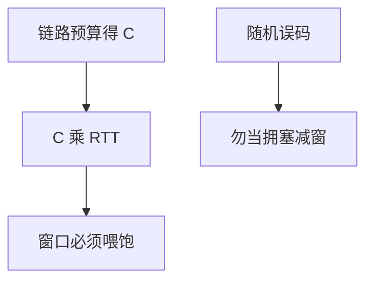

# 卫星与高延迟链路

同步轨道一轮 RTT 以数百毫秒计，带宽时延积撑大窗口；丢包若被当成拥塞，TCP 会把空管道当成忙。

<footer>—— 据 RFC 2488 卫星上的 TCP；ITU-R 卫星链路预算通识；Kurose and Ross 延迟带宽节整理</footer>

[上一课](/cs/5g-slicing) 把地面蜂窝时延做到毫秒级合同。卫星把传播时延重新变成主导。缺口是**高延迟链路**：GEO 长 RTT、LEO 切换与变化 RTT；[拥塞控制](/cs/tcp-congestion) 的丢包假设在此破裂。本课结束「无线与广域」；下一单元域内路由。

## 问题

$C$ 仍由功率与带宽决定（链路预算、雨衰），但 BDP $=C\times\mathrm{RTT}$ 可达兆字节。窗口缩放后课才细讲；这里先钉：默认 64 KiB 窗口喂不饱卫星。随机误码使 AIMD 减窗，吞吐塌在远低于 $C$ 处——PEPs、编码、或延迟型/基于容量的拥塞（后课 BBR）是对策方向。LEO：时延小但路径变，会话迁移像后课 QUIC 迁移的物理版。

不要把「卫星网」写成以太网：没有 PACING 的 PAUSE 能跨 36000 km 有用地工作。

RFC 2488 收集卫星 TCP 建议。GEO 约 250 ms 单程量级。本课不把星座路由协议写完。

### 痛点常是 RTT 不是 $C$

BDP 撑大窗口；随机误码若当拥塞则 AIMD 抽空。PAUSE 跨 GEO 无用。LEO 切换更像路径迁移。

## 方法

对照：光纤 5 μs/km vs GEO 固定长延迟。画：预算 → $C$；RTT → BDP；误码 → 勿当拥塞。巨型帧摊头税在此有用，但重传一整帧更痛，FEC 更重要。

方法止于选定对象与对照；机制才说它如何嵌入已有分层与主干课。

## 机制

蜂窝 URLLC 与卫星是时延谱的两端。主干分层仍成立：物理做 FEC，传输做窗口，应用做 FEC 或重试。生成树不会跨卫星广播域去算——IP 路由才行。测量后课的 ping 在此直接读到传播下限。

LEO 网关切换：IP 锚若在地面关口，类似蜂窝核心；若星上转发，拓扑动态更像后课流量工程。

## 边界

本课不引入深空 DTN 捆绑层全文。OSPF 区域与 LSA 是下一单元第一课。后课默认：高 RTT 链路用 BDP 与误码模型约束 TCP，不沿用局域网直觉。

监管与频谱许可约束真实 $B$，与 Wi‑Fi ISM 不同。

上一课留下的缺口在本课收口；「卫星与高延迟链路」进入后课词汇表后只引用。文献用来钉对象与边界，不把本课写成该主题的独立综述。下一课[OSPF 区域与 LSA](/cs/ospf-areas-lsa)。

## 小结

- 卫星 $C$ 来自功率带宽；痛点常是 RTT 与误码。
- 丢包≠拥塞时 AIMD 低估容量。
- 物理 FEC 与大窗口是配套，PAUSE 无用。
- 后课只引用本课钉死的对象，不从该领域总问题重开。
- 出处：RFC 2488；ITU-R 链路预算；Kurose and Ross。
