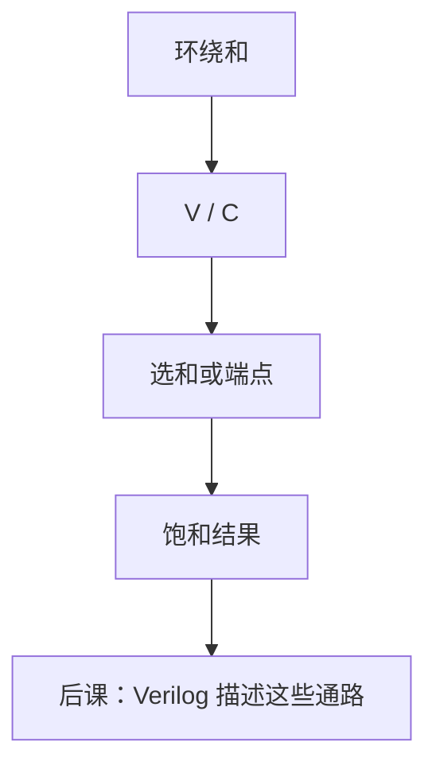

# 饱和运算

  
溢出时不环绕成符号相反的数，而是钉在可表示的最大或最小：音频与像素更怕「正满突然变负」，不怕少 1 个量化步。

  <footer>—— 据 Harris and Harris, Digital Design and Computer Architecture；Hennessy and Patterson, CA:AQA 整理</footer>

[上一课](/cs/overflow-detect)给出了 `V` 与 `C`。[定点 DSP](/cs/fixed-point-dsp) 的 MAC 截回窄宽度时，模 $2^n$ 环绕会把大幅度变成错误符号。缺口是算术单元本课序的收尾：**饱和**——结果夹在端点，而不是绕回。

## 问题

有符号饱和加：若 `V` 且结果为负，输出 $2^{n-1}-1$；若 `V` 且结果为正，输出 $-2^{n-1}$。无符号饱和：`C` 则钉在全 1 或 0（视加/减）。缺口不是新的溢出公式，而是结果 MUX：正常和 vs 两个端点常数。SIMD 指令（后课 SSE/NEON 的 `paddsb` 一类）把这套接到打包字节上；本课先钉标量/定点 MAC。

### 饱和不是 754 的 overflow

浮点 overflow 默认去无穷或最大有限数，并置[标志](/cs/fp-exceptions)。整数饱和通常**不**产生 NaN，也常常不置 754 那五位；DSP 可能另有 sticky overflow 位。把 `sat add` 当成 `fadd`，动态范围与非数规则全错。

多媒体 ISA 把饱和写成指令语义。Harris 在 ALU 旗标之后用 MUX 夹紧。本课不把图像处理算法写进来，只交电路。

## 方法

加法器算出环绕和与 `V`/`C`。MUX：无溢出选和；有溢出选由符号（有符号）或操作方向（无符号减到 0）决定的端点。乘后饱和：先看宽积是否超出目标 Q 格式，再夹紧。累加器可以内部不饱和、输出时饱和，避免一串 MAC 每步都钉死——由算法选。

与[浮点加法器](/cs/fp-adder)对照：浮点用指数扩展范围；饱和定点用端点牺牲线性，换取「不过零乱跳」。

## 机制

算术单元课序到此：乘除树与迭代、浮点对阶与 FMA、定点 MAC、溢出与饱和。下一单元用 HDL 描述这些块如何变成网表，而不是再发明一种算术。后课 ISA 的 SIMD 饱和指令只是把本课 MUX 铺 $W$ 份。

## 边界

本课不定义「无符号饱和乘」的每一种厂商变体，不讲 block floating-point 共享指数。不进入限价簿价格的定点，也不写光刻剂量控制环。

后课默认：饱和是溢出时夹紧到端点的结果 MUX；环绕仍是补码加法器的裸输出。

## 小结

- `V`/`C` 驱动端点 MUX，避免定点环绕改符号。
- 与 754 无穷/NaN 不是同一合同。
- 算术单元收尾；下一课改用 Verilog 写这些块。
- 出处：Harris and Harris；Hennessy and Patterson, CA:AQA。
