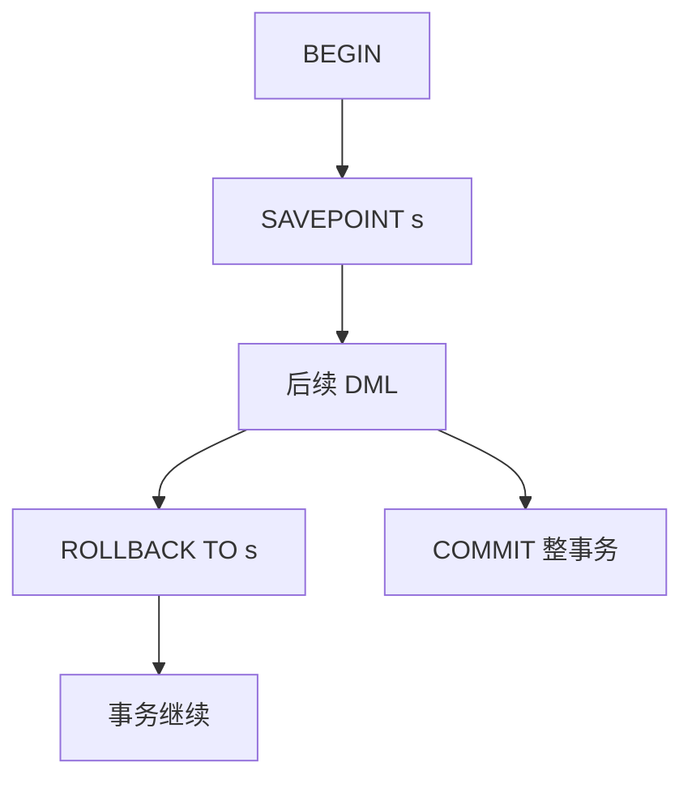

# 保存点

保存点在事务内部钉一截可回退的状态：撤销其后的更新，事务本身尚未结束，外层仍可提交。

<footer>—— 据 Gray and Reuter, Transaction Processing；SQL 对 SAVEPOINT；Ramakrishnan and Gehrke</footer>

[上一课](/cs/stored-procedures)把多语句收进过程。本课不重讲 `CALL`。缺口是过程或长事务里**局部失败**：第三条语句违反约束，是否必须丢掉前两条已做的更新？全事务回滚太粗；每条自动提交又失去原子性。保存点给出事务内的嵌套撤销。

## 问题

主干 [ACID](/cs/acid) 的原子性以事务为边界。实际脚本是：尝试插入，失败则改另一条路径，成功路径上的前序写入仍要留下。保存点：`SAVEPOINT s` 记录当前撤销链位置；`ROLLBACK TO s` 撤销之后的更新与（实现相关的）锁，事务继续；`RELEASE` 丢掉该标记。缺口是嵌套恢复的语义，不是再定义 commit。

与子事务（nested transaction）文献对照：完整嵌套事务有独立提交可见性规则；SQL 保存点更弱，通常仍是同一事务、同一提交。本课按 SQL 保存点讲，不把 Moss 嵌套事务模型整套搬进主干。

Gray and Reuter 把 savepoint 当作长事务与过程错误恢复的原语。实现上它是日志里的标记：UNDO 走到该 LSN 为止，而不是走到事务头。

## 方法

过程里：危险语句前设保存点，捕获约束错误则 `ROLLBACK TO`，改走分支。应用协议：批处理中单行失败不污染整批，但仍在一个提交里。注意：回滚到保存点后，其后获得的行锁是否释放因引擎而异，文档必须当合同读。

不能把保存点当成跨连接的会话魔法：连接断开，事务没了，保存点也没了。也不等于两阶段提交的子协调——跨资源仍是 [2PC](/cs/two-pc)。

## 机制

WAL：每条更新仍记日志；回滚到保存点通过 UNDO 补偿（ARIES 后课的 CLR 同源）。已刷盘的日志不会消失，只是逻辑上那些更新被补偿。并发：保存点不引入新隔离级别；可见性仍按事务快照或锁协议。

保存点深度有限制。循环里每轮新建保存点要释放，否则资源涨。触发器与保存点交错：触发器里回滚到外层保存点可能毁掉调用方预期，属于过程设计错误。

## 边界

本课不讲模式迁移如何用事务包住 DDL——下一课。也不把保存点当业务「草稿箱」：长事务持锁，保存点减的是撤销粒度，不是锁范围的理论上限。

后课默认：需要语句级失败隔离时用保存点，需要全体成功或全体失败时不要拆保存点冒充多事务。模式演化下一课：约束与表结构的版本化变更。

原子性边界仍是事务。保存点是事务内部的 UNDO 游标。

## 小结

- 保存点允许事务内部分回滚，提交仍是一次。
- 实现依赖日志 UNDO；锁释放规则因引擎而异。
- 模式迁移下一课：DDL 与数据回填如何分步还不丢不变式。
- 出处：Gray and Reuter；SQL SAVEPOINT；Ramakrishnan and Gehrke。
