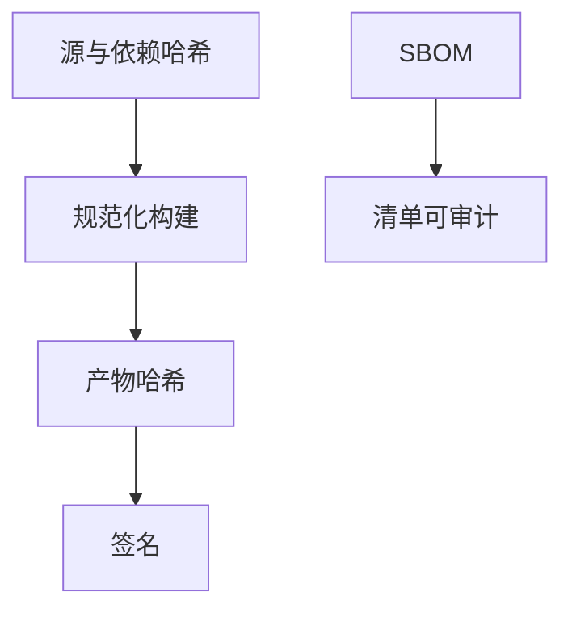

# SBOM 与可复现构建

你跑的那份二进制，必须能回答「里面有哪些依赖、是不是宣称的那份源码编出来的」。SBOM 是清单；可复现构建让第三方复验哈希。

<footer>—— NTIA/CISA 对 SBOM 的最小要素；Debian 可复现构建；Wheeler 对信任编译器的讨论</footer>

## 定位

上一课[浏览器沙箱](/cs/browser-sandbox)缩小运行时权限。缺口是**产物从哪来**：依赖与编译器。本课收清单与复现，不把供应链攻击写成操作手册。

后课默认已经读完本课钉下的合同，只补差，不从该领域第一性原理重开。

## 问题

SolarWinds 一类事故说明签名过的更新仍可能背刺——点名机制：构建系统被插。SBOM：组件名与版本。可复现：同样源→同样哈希。缺口是工程合同，不是密码学新原语。

### 时间戳与路径

不可复现常是嵌入时间、乱序、绝对路径。要规范化。

CISA SBOM。Reproducible Builds 项目。Ken Thompson 的信任信任攻击是极限：编译器自身。

## 方法

对照：只锁版本号 vs 锁哈希 vs 复现。签名要在复现哈希上。下一课依赖混淆：名字空间抢注。

图中节点是本课的机制骨架；课程不把图展开成可运行的攻击步骤。

## 机制

完整性要从运行时收到构建时。下一课依赖混淆：包管理器如何把名字解析到错误发布者。

前提写进合同之后，游戏外的误用只当失败模式点名，不在本课写成操作程序。

## 边界

本课不写投毒构建农场的步骤。依赖混淆下一课。

## 小结

- 沙箱不管你编进了谁的库。
- SBOM 列组件；可复现复验哈希。
- 签名应钉复现产物。
- 下一课依赖混淆。
- 出处：CISA/NTIA SBOM；Reproducible Builds；Thompson, Reflections on Trusting Trust。
