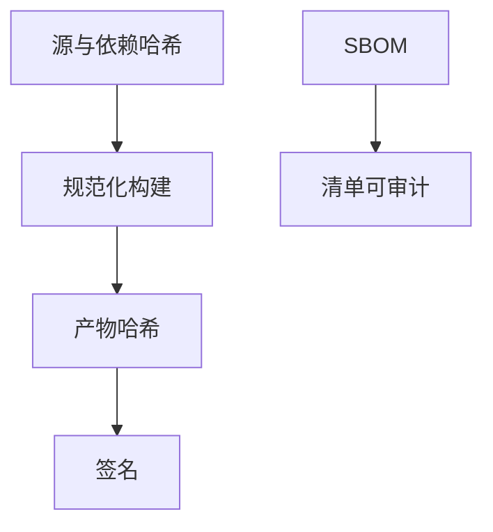
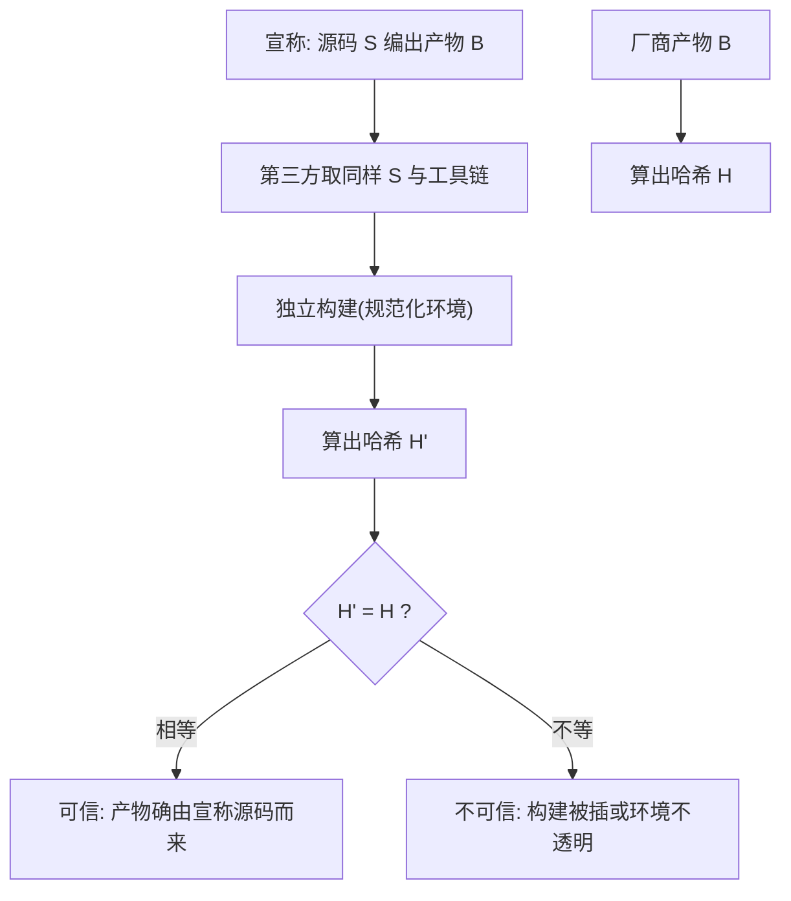

# SBOM 与可复现构建

你跑的那份二进制，必须能回答「里面有哪些依赖、是不是宣称的那份源码编出来的」。SBOM 是清单；可复现构建让第三方复验哈希。

<footer>—— NTIA/CISA 对 SBOM 的最小要素；Debian 可复现构建；Wheeler 对信任编译器的讨论</footer>

上一课[浏览器沙箱](/cs/browser-sandbox)缩小运行时权限。缺口是**产物从哪来**：依赖与编译器。本课收清单与复现，不把供应链攻击写成操作手册。

后课默认已经读完本课钉下的合同，只补差，不从该领域第一性原理重开。

## 问题

SolarWinds 一类事故说明签名过的更新仍可能背刺——点名机制：构建系统被插。SBOM：组件名与版本。可复现：同样源→同样哈希。缺口是工程合同，不是密码学新原语。

### 时间戳与路径

不可复现常是嵌入时间、乱序、绝对路径。要规范化。

CISA SBOM。Reproducible Builds 项目。Ken Thompson 的信任信任攻击是极限：编译器自身。

「SBOM」就是软件物料清单——像食品包装上的配料表：列出二进制里每个组件的名字与版本。有了它，Log4Shell 一爆发你才能在几分钟内查出自家哪些产物受影响，否则只能全网翻依赖树。

数字实例：不可复现的经典来源是构建路径——同一次编译，路径 `/home/alice/project` 与 `/home/bob/project` 会把路径字符串嵌进调试信息，产物哈希就不同。规范化（固定路径、剔除时间戳、固定文件顺序）之后，两人才算出同一个哈希。

常见误区：初学者容易以为「签名 = 安全」。签名只证明「这份产物出自持钥者」，不证明「产物对应宣称的源码、没夹带别的」；可复现构建才把「源码 → 哈希」这条链交给第三方复验。

## 方法

对照：只锁版本号 vs 锁哈希 vs 复现。签名要在复现哈希上。下一课依赖混淆：名字空间抢注。

```mermaid
flowchart TD
  SRC["源与依赖哈希"] --> BUILD["规范化构建"]
  BUILD --> BIN["产物哈希"]
  SBOM["SBOM"] --> INV["清单可审计"]
  BIN --> SIG["签名"]
```

## 机制

完整性要从运行时收到构建时。下一课依赖混淆：包管理器如何把名字解析到错误发布者。

```mermaid
flowchart TD
  CLAIM["宣称: 源码 S 编出产物 B"] --> OTHER["第三方取同样 S 与工具链"]
  OTHER --> REB["独立构建(规范化环境)"]
  REB --> H1["算出哈希 H'"]
  VENDOR["厂商产物 B"] --> H2["算出哈希 H"]
  H1 --> CMP{"H' = H ?"}
  CMP -- "相等" --> OK["可信: 产物确由宣称源码而来"]
  CMP -- "不等" --> ALARM["不可信: 构建被插或环境不透明"]
```

这张图回答的问题是：可复现构建如何把「口头宣称」变成「可独立验证」——第三方不需要信任构建农场，只要重跑一遍规范化构建并比对哈希，不等就当场报警。

## 边界

本课不写投毒构建农场的步骤。依赖混淆下一课。

## 小结

- 沙箱不管你编进了谁的库。
- SBOM 列组件；可复现复验哈希。
- 签名应钉复现产物。
- 下一课依赖混淆。
- 出处：CISA/NTIA SBOM；Reproducible Builds；Thompson, Reflections on Trusting Trust。
