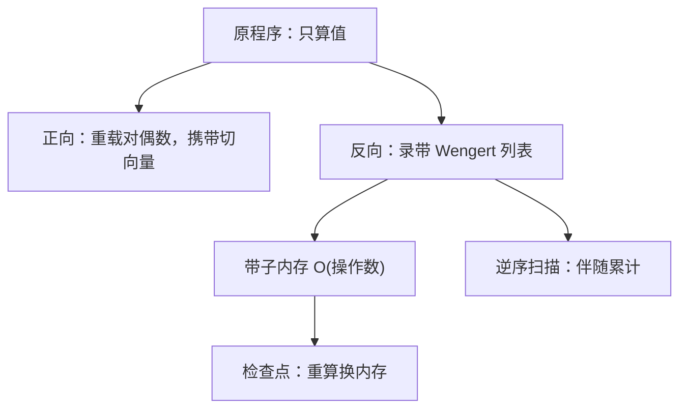
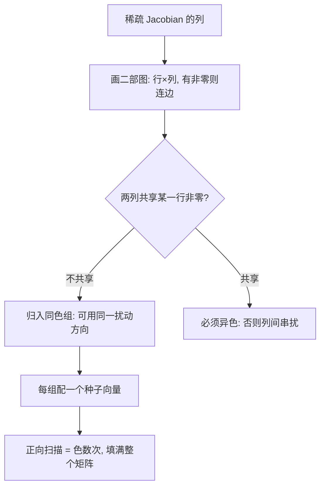

# 自动微分的实现

链式法则只有一个，实现却要回答程序问题：导数放在哪、何时算、内存换时间换到哪一档。

<footer>—— 据 Griewank and Walther, Evaluating Derivatives, SIAM, 2008；Baydin et al., JMLR, 2018 整理</footer>

[上一课](/cs/sc-sparse-computing)把线性代数按非零结构组织；本课把导数按计算结构组织。两种模式的复杂度账——正向算 $Jv$、反向算 $u^\top J$——大模型栏的[自动微分的正向与反向模式](/llm/autograd-two-modes)已经算过，计算图的视角在[自动微分与计算图](/llm/autograd-graph)，金融栏的[伴随算法微分 AAD](/quant/aad-adjoint) 给过定价里的用法。缺口在实现层：同一链式法则怎么落到程序上——重载、源码变换、录带回放各选什么，带子内存怎么还，稀疏 Jacobian 怎么接上一课的图。后课默认梯度可以按合同供给。

## 问题

「自动微分零成本」是广告，实际要付三类钱：每步常数倍的额外算术（正向与反向各算各的）、反向的中间值存储、以及不可微处的约定。三类钱不挑明，实现就在两处翻车：深计算图把带子堆到内存爆炸；或把前向代码机械复用当 VJP，数值上重新付一遍指数甚至上溢。缺口是把这些代价变成可选、可算、可归因的工程参数。

## 方法

正向模式不录带：对偶数 $(v,\dot v)$ 随原程序走，运算符重载在数类型上长出一套伴随算术，适合 $n$ 小 $m$ 大、或导数要随点更新的场景。反向模式分两趟：先录带——Wengert 列表记下每个原语的输入与局部导数——再逆序扫一遍做伴随累计；带子内存 $O(\#op)$，还债靠检查点：前向每隔一段存状态，反向时局部重算，二项检查点把重算次数压到对数量级（Griewank 与 Walther 的账）。二阶信息用 forward-over-reverse 组合：先带切向量正向扫，再反向，一次得 Hessian-vector 积。

## 机制

实现质量的分界线在 VJP 的写法：伴随公式要按输出的**稳定形式**重写，不能机械复用前向代码。softmax 是标准反例：前向算过 $\exp$，反向若照抄要重指一道指数并可能上溢；改用输出写 $\bar x_i=p_i\bigl(\bar y_i-\sum_j p_j\bar y_j\bigr)$，省一半指数又天然有界——上一课「把舍入集中到无害位置」的思维在这里变现。分支与折点是第二处分界：`if` 走了哪支、`max` 在何处折弯，必须记进带子并固定约定（次梯度取哪一侧），否则同一段代码两次运行给出不同导数，优化器的诊断全部失真。

稀疏 Jacobian 是第三处：结构稀疏时不必逐列扫描——把「两列从不出现在同一行」画成二部图，图着色分组，一个种子方向覆盖一整组互不相交的列，正向扫 $\chi$ 次（色数）就填满整个 Jacobian；反向同理按行分组。上一课的图视角在这里直接接上：稀疏性是计算图的性质，导数矩阵继承它。

这张图回答的问题是：稀疏 Jacobian 为什么不必逐列扫描——着色把「互不碰行」的列并成一组，一次种子扰动同时测一组列，扫描次数从列数降到色数。

反向模式一次反向的代价约为前向的 2 到 4 倍算术加带子管理——这是 Griewank 与 Walther 给的经验界；AAD 在金融库里能活着，靠的就是这个常数倍，而不是「导数免费」。

「带子」（Wengert 列表）就是反向模式记的流水账：每个原语操作一行，记输入和局部导数。反向扫描时从最后一行倒着读、逐行乘上伴随——它把「整条链式法则」拆成了一串查表乘法。

数字实例：$n=10^4$ 个输入、$m=1$ 个输出的函数，反向一次得全梯度（代价约 2–4 倍前向）；正向模式要扫 1 万次才能凑齐同样信息。反过来，$m\gg n$ 时结论倒置——选模式先数 $n$ 和 $m$ 谁大。

## 边界

本课不重算两种模式的复杂度（引用课已给），不进异构与分布式的梯度同步，不写任意精度微分。带子、检查点与着色都有实现成本，问题足够小或导数手写更短时，AD 不是默认答案。后课默认：梯度供给是优化库里的一条合同轴——解析、AD 或差分任选其一，下一课把它当输入。

## 小结

- 正向重载零录带，反向录带换全局性；选择由 $n$ 与 $m$ 谁大决定。
- 带子内存用检查点还：二项检查点把重算压到对数量级。
- VJP 按输出的稳定形式重写；softmax 反例是实现质量的分界线。
- 分支与折点记进带子并固定约定，否则导数不可复现。
- 稀疏 Jacobian 用图着色分组，导数矩阵继承计算图的稀疏性。
- 出处：Wengert, Comm. ACM, 1964；Griewank and Walther, 2008；Baydin et al., JMLR, 2018。
