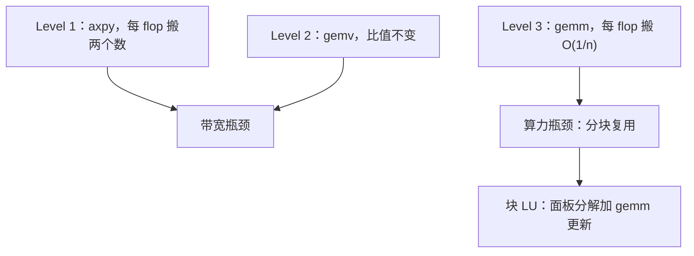
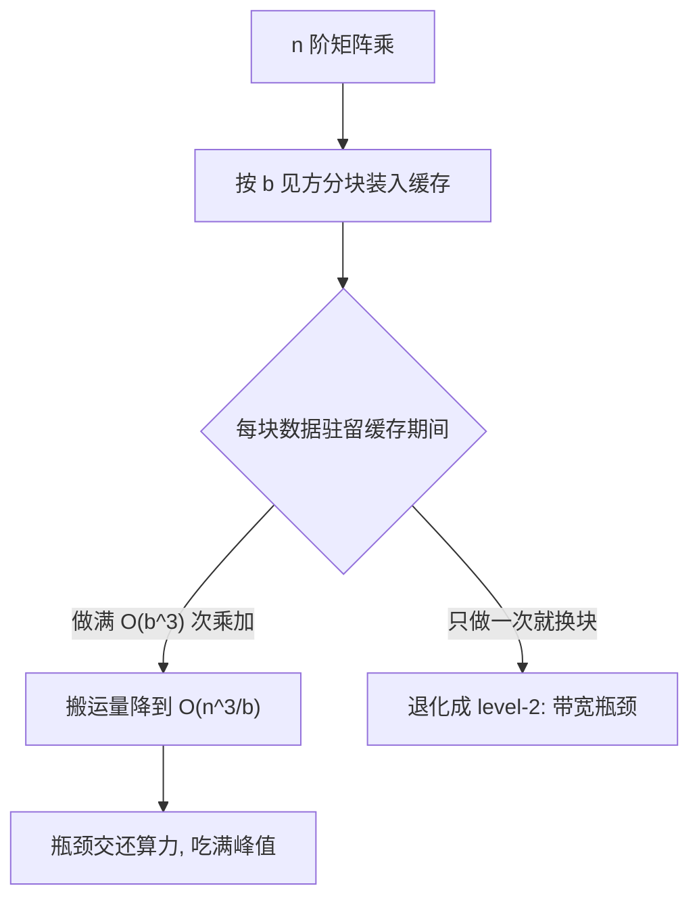

# BLAS 的层次

矩阵运算的分类标准不是代数复杂度，而是每做一次浮点运算要搬多少字节；层次分的是访存账，不是数学。

<footer>—— 据 Lawson et al., ACM TOMS, 1979；Dongarra et al., ACM TOMS, 1988 与 1990 整理</footer>

[上一课](/cs/sc-float-deep)把 FMA 与 two-sum 钉成算法资源：舍入可以被集中、被消灭。本课把这份合同交给它最大的用户——稠密线性代数库。主干已给过 [Roofline 模型](/cs/roofline-model)的算力带宽框架、[SIMD 扩展](/cs/simd-extensions)的指令面与[高斯消元与主元](/cs/gaussian-pivoting)的分解合同；缺口是：BLAS 为什么分三层、第三层为什么是所有稠密分解的速度来源、分层的代价又记在哪本账上。后课默认你能按层读任何线性代数调用。

## 问题

同一个 $C\leftarrow C+AB$，朴素三重循环与分块实现可以差一个数量级；LU 若写成标量消元，编译器再努力也吃不满峰值。缺口不是「写得更巧」，而是把**每 flop 搬运的字节数**当一阶量：三层的差别全在这里。分不清层，优化就找错对象——给 level-2 的循环做向量化，收益封顶在带宽上，与指令集无关。

## 方法

三层各一个代表。Level 1 是向量运算：`axpy` 算 $y\leftarrow y+\alpha x$，$O(n)$ 数据对 $O(n)$ 运算，每 flop 搬两个数，被带宽钉死。Level 2 是矩阵向量：`gemv` 与秩一修正，$O(n^2)$ 数据对 $O(n^2)$ 运算，比值没变，仍是带宽问题——只是行主列主让带宽的利用率变得挑剔。Level 3 是矩阵矩阵：`gemm`，$O(n^2)$ 的数据吃 $O(n^3)$ 的运算，每 flop 搬运 $O(1/n)$ 字节，瓶颈交还给算力，缓存分块让一块数据在寄存器与各级存储里复用。

把强度算出来：$n=1000$ 的 `gemm` 做 $2n^3\approx 2\times10^9$ 次 flop，只碰 $24$ MB 数据，算术强度约 80 flop/字节；`axpy` 每 16 字节只做 2 次 flop，强度约 0.1。差三个数量级——这就是同一台机器上两层调用速度差几个数量级的来路。

「算术强度」就是每搬 1 字节数据能做几次浮点运算——它是判断一段代码「卡带宽还是卡算力」的尺子。强度低于机器的「平衡点」（flop 峰值 ÷ 带宽峰值）就是带宽瓶颈，优化方向是少搬数据而不是更快的乘法。

直觉类比：level-1 像一人一趟只拎一瓶水（搬一次用一次）；level-3 像整车运水到水塔再慢慢分（搬一次用很多次）。水塔（缓存）容量有限，所以要用「分块」控制每次运多少。

分层的真正兑现，是把分解改写成 level-3 调用：块 LU 把消元组织成「面板分解加三角乘与更新」，选主元仍按[高斯消元与主元](/cs/gaussian-pivoting)的合同在面板上进行，其余工作量全部落进 `gemm`。这也解释了实现栈的分工：Netlib 参考版保证正确与可读，厂商库（MKL、BLIS、Accelerate）只在同一接口下换内核——接口是 1979 年钉下的，内核随 SIMD、FMA 与缓存层级改写。

## 机制

Level 3 为什么吃得满：分块后每个 $b$ 见方的子块驻留缓存期间做完全部贡献，数据搬运从 $O(n^3)$ 降到 $O(n^3/b)$，[外存算法与 I/O 模型](/cs/external-memory-model)早就给过这条下界的形状。「库比手写快」的结构原因在这里：不是编译器差异，是运算被重写成搬运输入更小的形式。

代价记在数值账上。分块改变求和顺序，[求和顺序](/cs/summation-order)的界随重排变化；块 LU 与标量 LU 在浮点里不是同一条路径——残差都在 $\gamma_n$ 量级，比特却不再逐位一致。要复现就得固定分块与内核，这是上一课「合同」的延伸：精确块归调用方，运算组织归库，两头都要钉死。FMA 在内核里再省一次舍入，改变的是 $\gamma_n$ 的常数，不改 754 位型。

这张图回答的问题是：`gemm` 吃满峰值的条件到底卡在哪——分块尺寸必须让子块「驻留期内做完全部贡献」，块太大装不进缓存、块太小退化成 level-2 的搬运模式，两头都掉速。

## 边界

本课不进具体内核的微架构，不把 LAPACK 驱动层（`gesv`、`potrf`）展开，只指出它建立在三层之上；GPU 上的布局与占用是另一门课的对象。稀疏矩阵没有这种红利——每行不定长、间接寻址让 `gemm` 式复用难产——那是下一课的对象。后课默认：见到稠密调用先问落在哪层，level-2 走不进峰值，也别指望它在峰值。

## 小结

- 三层的差别是每 flop 的搬运量：level-1 与 level-2 被带宽钉死，level-3 才轮到算力。
- 块分解把消元改写成面板加 gemm；主元合同不变，速度来自分块复用。
- 分块改舍入路径：残差量级不变，逐位复现要钉分块与内核。
- 参考版与厂商库共享接口，优化发生在内核，不发生在接口。
- 出处：Lawson et al., 1979；Dongarra et al., 1988 与 1990；Golub and Van Loan, Matrix Computations。
