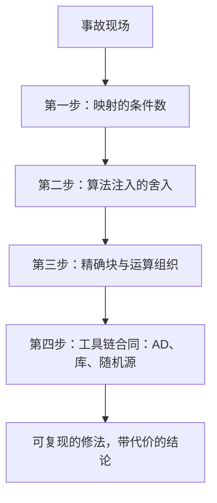

# 精度与稳定性的案例与收束

数值事故很少死于不懂定理，多死于把三个可修的错叠在一起：公式、顺序与合同。

<footer>—— 据 Goldberg, ACM Computing Surveys, 1991；Higham, Accuracy and Stability of Numerical Algorithms 整理</footer>

[上一课](/cs/sc-optimizer-libraries)把优化库的合同对齐到四条轴，工具链至此配齐。本课是「数值与科学计算」的最后一课，用四个案例把全课程串成一条检查链：每个案例按同一格式过一遍——朴素写法、错在哪、修法与代价。本课程到此收束。

## 问题

案例课的风险是变成趣闻集，所以先钉串起它们的线，它正是主干与深钻共同的那条：先问映射的条件（[条件数](/cs/condition-number)），再问算法注入的舍入（[前向稳定与后向稳定](/cs/forward-backward-stability)），然后用精确块（[浮点数的深入](/cs/sc-float-deep)）与运算组织（[BLAS 的层次](/cs/sc-blas-levels)、[稀疏计算](/cs/sc-sparse-computing)）修实现，外围靠工具链合同守住（[自动微分的实现](/cs/sc-autodiff-implementation)、[优化库的对照](/cs/sc-optimizer-libraries)、[随机数生成](/cs/sc-random-generation)）。四案不是孤例，是这条链的四种走法。

## 方法

**案例一，二次方程。** 求根公式 $x=\frac{-b\pm\sqrt{b^2-4ac}}{2a}$：当 $b\gt 0$ 且 $4ac\ll b^2$ 时，$-b+\sqrt{\cdots}$ 是两个近的大数相减——减法本身精确（[消去与灾难抵消](/cs/catastrophic-cancellation)），坏在两个操作数各带 $u$ 级相对误差，相消后放大成大相对误差。修法：令 $q=-\frac{b+\mathrm{sign}(b)\sqrt{b^2-4ac}}{2}$，两根为 $q/a$ 与 $c/q$——韦达定理把危险的减法换成除法，代价是一次符号判断。

**案例二，方差。** 单趟公式 $m_2-m^2$：数据在 $10^8$ 附近、真方差 $10^2$ 时，两项都是 $10^{16}$ 量级，双精度相减只剩约三位有效，结果可以是负数。Welford 递推把大数相消从公式里拿掉：$\bar x_k=\bar x_{k-1}+\frac{x_k-\bar x_{k-1}}{k}$，平方和用增量更新（Welford, 1962；Chan, Golub 与 LeVeque, 1983 给过误差分析）。代价是循环串行——要并行就回到成对合并的账。

把案例二的账算开：均值 $10^8$ 时 $m^2\approx10^{16}$，双精度 $u\approx1.1\times10^{-16}$，一项的舍入误差就有 $1$ 量级；两式相减剩下的方差若只有 $10^2$，绝对误差与之同量级——负方差不是奇观，是这个减法的正常输出。

**案例三，求和。** $10^8$ 个同号双精度数顺序求和，误差按 $\gamma_n$ 长到 $nu\approx 10^{-8}$ 的相对量级；成对求和压到 $u\log n$，Kahan 补偿用 two-sum 把误差拿回到常数倍 $u$（[求和顺序](/cs/summation-order)）。而库里的并行归约顺序不定——复现与性能的合同要自己钉（[BLAS 的层次](/cs/sc-blas-levels)）。

**案例四，softmax。** binary32 里 $\exp(89)$ 已上溢（$\ln(3.4\times10^{38})\approx 88.7$）。先减最大值再取指数：数学上是恒等变换，数值上把溢出变成不可能；反向 VJP 用输出形式写，同样有界（[自动微分的实现](/cs/sc-autodiff-implementation)）。

## 机制

四案共享一个反直觉点：修法全部不减少误差的**来源**，只把误差从会被放大的位置挪到不会的位置——韦达把相消换成除法，Welford 把大数相消换成增量，成对求和把线性增长换成对数，减最大值把溢出换成平移。判断「挪到哪里」的依据始终是条件数与稳定性语言：这就是主干与深钻分层的原因——深钻给资源，主干给判据。反着用也成立：看到「加一个减最大值」「换一种求和树」这类补丁时，先问它挪走了哪一项放大，再决定要不要抄。

## 边界

本课不再引入新对象；后向稳定的证明、补偿求和的界、方差算法的误差分析都在引用课与出处文献里。四案之外没有万能清单——清单的价值在你肯把每一个新计算都过一遍这条链；跳过判据直接抄补丁，是这四案共同的另一种死法。

## 小结

- 二次方程：近量相减的下游才是事故；韦达把减法换成除法，代价一次判断。
- 方差：单趟平方和在量级悬殊时相消到负数；Welford 增量把相消从公式里拿掉。
- 求和：顺序误差随 $n$ 线性长；成对压到对数、补偿拿回常数，复现靠钉顺序。
- softmax：减最大值用恒等变换买断溢出，正向反向同时受益。
- 检查链：条件数、注入、精确块与组织、工具链合同，四案各走一遍。
- 出处：Goldberg, 1991；Higham；Welford, Technometrics, 1962；Chan, Golub and LeVeque, 1983。
