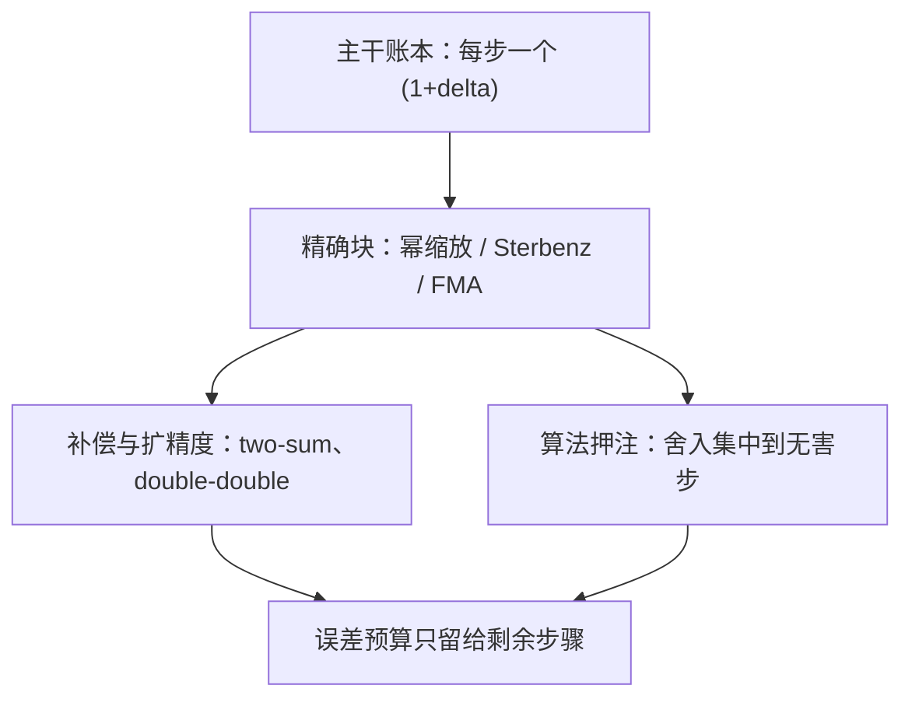

# 浮点数的深入

误差模型告诉你每步至多丢多少，精确性定理告诉你哪几步一步都不丢；只会前者的人，把所有账都算成运气。

<footer>—— 据 Goldberg, ACM Computing Surveys, 1991；Higham, Accuracy and Stability of Numerical Algorithms 整理</footer>

[上一课](/cs/ss-case-map)给「系统安全深化」收束：Dirty Pipe 对内核类别、Log4Shell 对供应链、CrowdStrike 对特权健壮性、Pegasus 对移动与硬件，四个公开案例对表归档——合法输入也能击穿特权层，安全是整条栈的性质。安全的类别表交了卷；数值主干到[插值与龙格现象](/cs/interpolation-runge)收口时留过一句：不再碰 IEEE 位型本身。本课是「数值与科学计算」的第一课，偏偏回到位型。[IEEE 754](/cs/ieee-754) 给过位布局，[舍入模式](/cs/rounding-modes)给过四种朝向，[非规格化与 NaN](/cs/denormal-nan) 给过边界编码；主干没有回答的是写算法的人每天要问的问题——**哪些浮点运算给出的结果是精确的**。后课默认已经读完本课。

## 问题

$\mathrm{fl}$ 模型是上界思维：每次运算至多引入 $|\delta|\le u$ 的相对扰动。设计补偿算法、验证实现技巧、谈判跨平台复现时，需要的却是下界思维：哪几步**一个舍入都不引入**。分不清这两件事两头都错：把可以精确的事实也算进误差预算，算法显得比实际更不可救；把不精确的步骤当精确，又会在 $u$ 量级上赌输。缺口因此是一份精确运算清单，外加它的两个推论——ulp 与相对误差的错位、用两个机器数拼一个更精的数。

### 精确运算清单

三条。其一，乘除 2 的幂精确：尾数不动、指数平移，除非撞上溢出或跌进非规格化。其二，Sterbenz 引理：若 $y/2\le x\le 2y$，则 $\mathrm{fl}(x-y)$ 逐位等于 $x-y$——近量相减这一步零舍入；[消去与灾难抵消](/cs/catastrophic-cancellation)里危险的正是它的**下游**，不是这一步本身。其三，FMA：$\mathrm{fl}(ab+c)$ 只舍一次，全精度积在单元内部保留；[浮点乘法与 FMA](/cs/fp-mul-fma) 给过指令，这里把它当「消灭一次中间舍入」的算法资源。

Sterbenz 的适用面比直觉宽：双精度里算 $1.0000001-1$，这一步零误差，误差全部来自 $1.0000001$ 自己怎么来的。所以「减法丢精度」的说法不精确——丢精度的是把两个本不相等的量对消到近零之后还当真，对消那一步恰恰是精确的。

## 方法

拿到清单，写算法的思路从「尽量少运算」变成「把舍入集中到无害的位置」。补偿求和是第一应用：[求和顺序](/cs/summation-order)点过名的 Kahan 补偿要恢复每次加法丢掉的残差，靠的是 two-sum——加法虽不精确，却满足 $\mathrm{fl}(a+b)=(a+b)-e$，且 $e$ 本身可被精确算出，这是舍入到最近规则赠予的逆运算。第二应用是扩精度：Dekker 的 double-double 用一对双精度数表示约 106 位有效数字，运算归约到 two-sum 与两积之差的精确恢复，代价约二十次 flop，换来在 $\kappa$ 逼近 $1/u$ 的问题上继续工作。

## 机制

这些精确性为什么成立，答案全在位型里。近量相减：对阶之后两数指数相等，差是同尺度的小数，天然落在网格上，不需要舍入。FMA：中间积以无限精度留在单元里，只有出口舍一次。two-sum：舍入误差 $e$ 本身是两个机器数之差，可以再用同样的加法结构恢复。三者的共同点是：**精确性是位布局与舍入规则的推论，不是硬件的额外承诺**——所以编译器打开收缩与重结合（[fast-math](/cs/fast-math)）时，FMA 合同与求和顺序会被改写，补偿算法当场失效。精确块是写给编译器的合同，不是写给自己看的注释。

ulp 语言补最后一块：相对误差随二进指数逐 binade 摆动，同一格式在下缘比上缘「更准」一倍；比较两种实现的精度声明时先问口径是 ulp 还是相对误差，否则 $2^{-53}$ 对 $2^{-54}$ 的争吵没有裁判。

## 边界

本课不重画位域、不重列异常旗标，那些在[非规格化与 NaN](/cs/denormal-nan) 与[浮点异常与标志](/cs/fp-exceptions)；十进制 754 与正确舍入的超越函数库也不展开——后者是库的合同，不是标准强制的。double-double 不是任意精度：仍是浮点，仍会溢出，只是把 $u$ 推小约半量级。后课默认：近量差精确、FMA 消一次舍入、two-sum 可行，并把它们当算法资源使用。

## 小结

- 精确块：2 的幂缩放、Sterbenz 近量差、FMA 单次舍入，都是位型与舍入规则的推论。
- 补偿求和与 double-double 靠 two-sum 的可逆性，把误差集中、把 $u$ 推小。
- fast-math 式的重结合与收缩会破坏精确块合同，补偿算法随之失效。
- 精度声明先分清 ulp 与相对误差口径。
- 出处：Goldberg, ACM Computing Surveys, 1991；Higham；Dekker, Numerische Mathematik, 1971；IEEE 754-2008。
