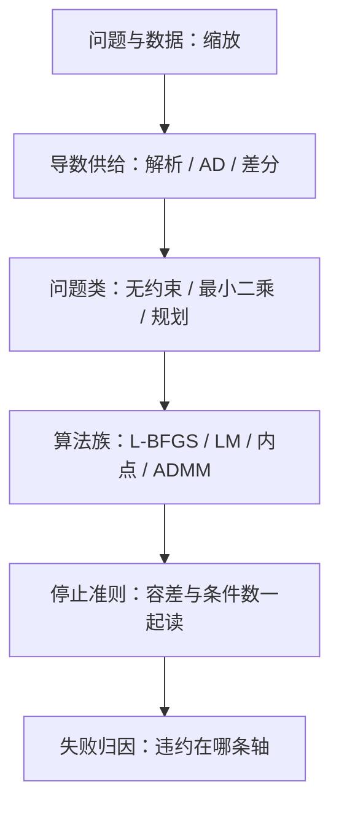

# 优化库的对照

优化库不是算法排名表，而是合同分类表；失败时要能指认违约的是哪一条——导数、问题类、停止准则，还是缩放。

<footer>—— 据 Nocedal and Wright, Numerical Optimization, Springer, 2006 整理</footer>

[上一课](/cs/sc-random-generation)给了可命名、可复现的随机源——多起点的原料。本课对照数值软件里最大的门类：优化库。主干已给[非线性方程与牛顿](/cs/newton-nonlinear)、[迭代法何时收敛](/cs/iterative-solver-converge)与[条件数](/cs/condition-number)；缺口不是再讲一遍算法，而是把「库与库的差别」归到几条合同轴上，让失败可以归因，而不是落在「这个库不行」的口头上。本课后，数值与科学计算的工具链就齐了。

## 问题

同一个问题，L-BFGS 收了，牛顿库发散，内点法报「不可行」；换一组缩放又全部反转。没有合同语言时，这些现象无法归因。缺口是把四件事拆成独立可换的选项：交出去什么（函数、梯度、Hessian 或都没有）、问题属于哪一类（光滑无约束、最小二乘、线性与锥规划）、算法族怎么停、变量怎么缩放。失败先归因到轴，再归因到库。

## 方法

轴一，导数供给：解析手写、自动微分（上一课的合同），或有限差分。前向差分要 $n+1$ 次函数求值，且梯度相对精度只有 $u^{1/2}$ 量级；中心差分提到 $u^{2/3}$，代价翻倍。梯度里的噪声直接封顶可达精度——合同从这里开始就不同库。

差分步长有最优值：前向差分取 $h\approx u^{1/2}$，误差被截断与舍入两头夹住；病态问题里 Hessian 的条件数再把这个噪声放大进梯度——可达解的精度跟着封顶。这条账是「梯度必须由 AD 或解析供给」的最硬理由。

轴二，问题类与算法族：大规模光滑无约束，L-BFGS 用最近 $m$ 步的曲率历史近似逆 Hessian，存储 $O(mn)$，是默认起点（Liu 与 Nocedal, 1989）；最小二乘用 Gauss-Newton 与 Levenberg-Marquardt，MINPACK 是参考实现（Moré, 1977）；非线性约束进内点法，IPOPT 的滤子线搜索是代表（Wächter 与 Biegler, 2006）；大规模二次规划，一阶 ADMM 的 OSQP 用中等精度与热启动换每次迭代的便宜（Stellato et al., 2020）。轴三，停止与缩放：梯度无穷范数的容差要连同 $\kappa$ 读——病态时梯度范数天然大，收紧容差只烧迭代；变量量纲差几个数量级，先平衡再进库，缩放是调用方的责任，不是库的魔法。

## 机制

对照按族不按库，因为同族共享失败模式。线搜索族怕非光滑与噪声：梯度是差分给的时候，线搜索在噪声里小步徘徊；信任域族用模型可信半径兜住同一种噪声——两族的分界不是好坏，是输入质量。内点与 ADMM 的分工是精度换速度：内点每次迭代解一个线性系、把对偶间隙压到 $10^{-8}$ 量级；ADMM 迭代便宜但只能给中等精度，且要为热启动付分裂变量的账。Nelder-Mead 单纯形不要求导数，代价是低维与特定条件下才有收敛结论（Lagarias et al., 1998），用在 $n$ 大或要精度的问题上是合同错配。多起点接上一课：起点流的命名与分工，决定「哪个起点找到的解」能不能写进报告。

## 边界

本课不进随机与随机梯度族——那是大模型栏的对象；不讲全局优化与分支定界，也不做跨库跑分——评测方法论另有课题。库的默认停止准则几乎总是过松或过紧，属于要显式设置的合同项。后课默认：优化调用先写清四条轴，失败先查轴再查库。

## 小结

- 合同四轴：导数供给、问题类、算法族、停止与缩放；失败先归因到轴。
- 差分梯度只有 $u^{1/2}$ 到 $u^{2/3}$ 级精度，病态时封顶可达解精度。
- L-BFGS 是大规模无约束默认；LM 管最小二乘；内点与 ADMM 用精度换迭代成本。
- Nelder-Mead 缺一般收敛理论，是合同错配的高发区。
- 出处：Nocedal and Wright, 2006；Liu and Nocedal, 1989；Moré, 1977；Wächter and Biegler, 2006；Stellato et al., 2020。
