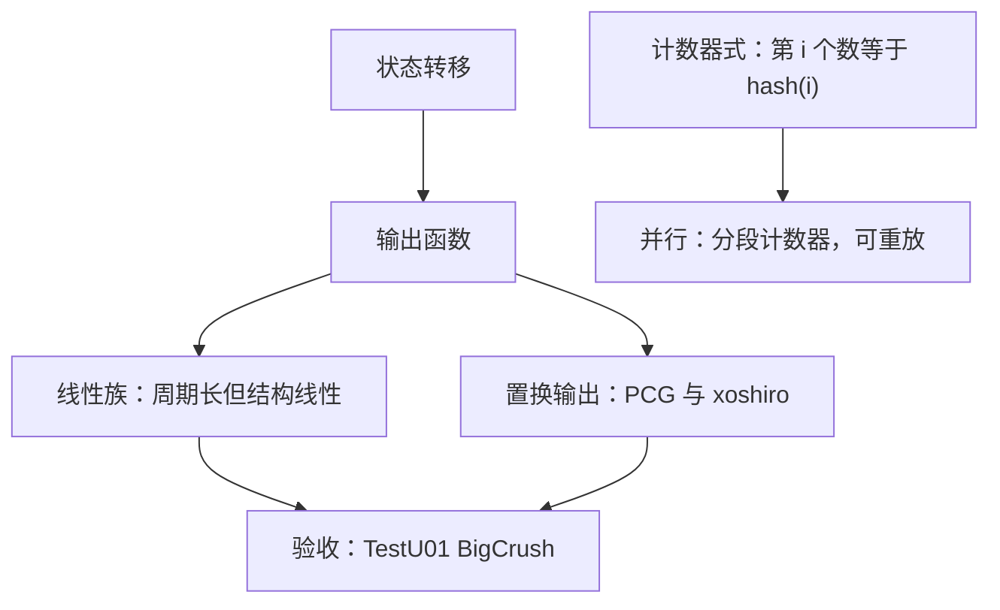

# 随机数生成

确定性机器上没有随机，只有长到看不出规律的确定性；生成器的合同是把规律藏过所有会用的检验。

<footer>—— 据 Knuth, The Art of Computer Programming, Vol. 2；L'Ecuyer and Simard, ACM TOMS, 2007 整理</footer>

[上一课](/cs/sc-autodiff-implementation)在确定性程序里把导数算准；本课在确定性机器上造「独立同分布」。主干的[随机化算法直觉](/cs/randomized-algo)与 [Las Vegas 与 Monte Carlo](/cs/las-vegas-monte-carlo) 给过「为什么随机」，[CSPRNG](/cs/csprng) 给过密码学的合同。缺口是科学计算那一份：周期、均匀性、并行流与可复现——蒙特卡洛把生成器的缺陷直接换算成估计量的偏差。后课默认随机源有名字、有种子、有流分工。

## 问题

C 库的 `rand()` 是 1960 年代的合同：周期短、状态暴露、`rand()%n` 有偏、跨库不可复现。蒙特卡洛用它，方差估计先错；并行模拟用它，各线程的流相关，样本互相抄袭。缺口是一份能挑选与验收的清单：按什么指标拒绝一个生成器，按什么方式给并行任务发流，按什么口径保证两个实验室算出同一条序列。

## 方法

生成器 = 状态转移加输出函数。经典线性族（LCG、MT19937）状态线性演化，周期可以极长——MT19937 达 $2^{19937}-1$（Matsumoto 与 Nishimura, 1998）——但结构线性：把连续输出叠成高维点，落在少数超平面上（Marsaglia, 1968），线性复杂度检验也抓得住它；TestU01 的 BigCrush 套件（L'Ecuyer 与 Simard, 2007）是常用的验收线。现代修法是输出置换：PCG 与 xoshiro 在线性状态外再套一层非线性输出，状态小、速度快、过 BigCrush。第三族是计数器式（Philox、Threefry，Salmon et al., SC 2011）：第 $i$ 个随机数就是计数器的哈希，没有状态演化——并行只需把计数器分段，天然可重放、可分块。整数区间用拒绝采样：先弃掉上界多余部分再取模。

模偏可以大到翻倍：32 位状态直接对 $n=3\times10^9$ 取模，$2^{32}\bmod n\approx 1.29\times10^9$，于是余数 $0$ 到 $1.29\times10^9-1$ 出现两次，其余只出现一次——一半的定义域概率是另一半的两倍。拒绝采样先丢掉 $\bigl\lfloor 2^{32}/n\bigr\rfloor n$ 之上的尾巴，偏差归零。

## 机制

「通过检验」是必要验收而非保证：BigCrush 覆盖均匀性与线性结构，通过只说明已知攻击面无恙；用在自相关敏感的算法（MCMC、随机化数据结构）上，仍要做应用级验证——同[条件数](/cs/condition-number)课的习惯，先问问题对输入的缺陷多敏感。可复现是硬要求：固定算法与种子，序列跨平台一致；各语言标准库的默认生成器互不一致，论文必须写明用的是哪一个。并行流要两件事同时成立：流间不相交，且每条流的统计性质与单流等价；跳进式（一次跳过 $2^{64}$ 步）与计数器分段都行，但线性生成器相邻流可能高度相关——这是 MT 在并行里的实际翻车点，计数器式天生没有这个问题。密码学的不可预测性不在此合同内：那要抗状态回溯与熵源攻击，见 [CSPRNG](/cs/csprng)。

## 边界

本课不讲真随机与熵源，不进方差缩减与拟蒙特卡洛——那些在蒙特卡洛方法的应用层；也不写具体常数表与实现细节，选型看验收报告而非传说。后课默认：多起点与扰动实验引用的随机流可命名、可重放，随机性不进入数值误差预算的「不可控」栏目。

## 小结

- 生成器是状态转移加输出函数；线性族被格结构与线性检验抓出。
- 置换输出（PCG、xoshiro）补线性短板；计数器式（Philox、Threefry）为并行与重放而生。
- 整数区间用拒绝采样，直接取模有偏，极端时偏差翻倍。
- 科学计算三件套：命名算法、固定种子、分工流；过 BigCrush 只是底线。
- 出处：Knuth, TAOCP Vol. 2；Matsumoto and Nishimura, 1998；L'Ecuyer and Simard, 2007；Salmon et al., SC, 2011。
