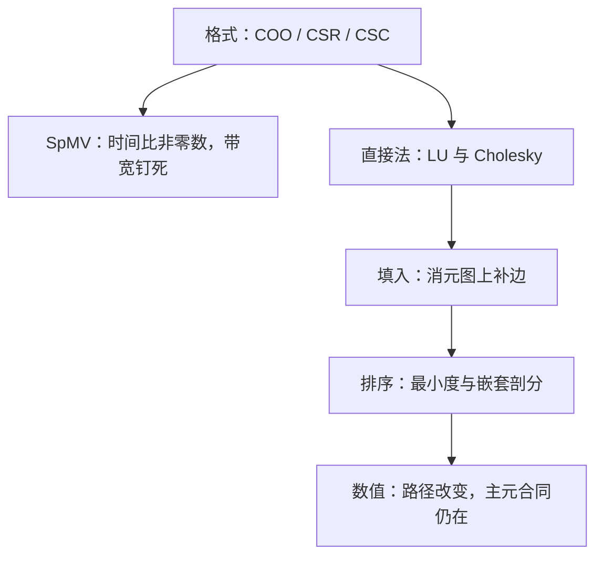

# 稀疏计算

稀疏计算省下的是零的存储与乘法，付出的是间接寻址与填入；账算不算得平，取决于零是怎么分布的。

<footer>—— 据 Davis, Direct Methods for Sparse Linear Systems, SIAM, 2006；Duff, Erisman and Reid, Direct Methods for Sparse Matrices, 1986 整理</footer>

[上一课](/cs/sc-blas-levels)的红利——每 flop 搬 $O(1/n)$ 字节——依赖稠密的规则性；图、网格离散与推荐矩阵把九成九的元素交成零，规则性随之消失。本课把线性代数搬进稀疏世界。主干已给过[边表与 CSR](/cs/csr-graph) 的存储视角；缺口是：稀疏格式怎么服务线性代数、SpMV 为什么停在带宽上、直接分解的成本为什么被填入而不是浮点决定。后课默认你按非零数与填入记账。

## 问题

$n=10^7$ 的三维网格矩阵，稠密存放要 $8\times10^{14}$ 字节，物理上不可行；它的非零只有约 $7n$ 个，稀疏存放几十字节级就能装下。存下来了，新的问题才开始：每行非零个数不一，间接寻址取代连续访存，level-3 的分块复用难产；做直接分解，浮点不是主要成本，消元把零变成非零的**填入**才是。缺口是三笔账：存储账（格式跟访问模式走）、带宽账（SpMV 的天花板）、填入账（分解的真实成本）。三笔账不分，就会在错误的层面优化。

## 方法

三种基本格式分工。COO 三元组管构造：插入任意次序的行列值，装配阶段用完即弃。CSR 行压缩管 SpMV 与行操作：行指针加列索引加值，一次遍历每个非零恰好做一次乘加。CSC 管列访问与分解：消元按列写回时用它。格式没有优劣，只有与访问模式的匹配——用 COO 做迭代求解的内层，或在 CSR 上频繁插列，都是在错的格式上付钱。

SpMV 的账最好算：时间正比非零数，但每个非零要连带一个 4 字节列索引，8 字节值加 4 字节索引加一次间接读 $x_j$，每 flop 的搬运量反而回到 level-1 的量级——纯带宽问题，预取与重排只在常数上打转。直接法的账难算得多：稀疏 Cholesky 与 LU 的成本在填入，消元图上每步消去一个顶点、把它的邻居两两连边，填入就是补出来的边；排序算法（最小度、嵌套剖分）全部在图上做文章，[边表与 CSR](/cs/csr-graph) 的图表示在这里直接接上。

交叉点常被忽略：非零密度上去或 $n$ 不大时，稠密反而赢——CSR 每个非零背约 12 字节的存储税与一次间接寻址，$n=2000$、密度两成的矩阵，稠密 gemm 的分块复用早已把稀疏的开销甩开。选稀疏前先问非零比例与维数，不是先问库。

## 机制

填入为什么是图论问题：对称正定矩阵的消元一一对应图的顶点消去，填入量由消去顺序决定而与数值无关——二维网格上嵌套剖分把填入从 $O(n^2)$ 压到 $O(n\log n)$ 量级，三维网格上填入涨得太快，直接法本身开始不合算，接力棒交给[迭代法何时收敛](/cs/iterative-solver-converge)。这是「分解还是迭代」的真实分界：不是品味，是维数与填入的账。

数值上，重排与消元顺序不改精确解，改浮点路径：为少填入选的行序与为稳定选的行序会打架，[高斯消元与主元](/cs/gaussian-pivoting)的部分主元合同在稀疏里多一条约束，超节点方法把两者折中。带着稠密直觉进场的人两头翻车：在 SpMV 上追峰值（它是带宽问题），或忽略填入直接分解（三维问题上内存先爆）。

## 边界

本课不进迭代法内部、不进并行稀疏三角求解与调度，低秩近似与压缩感知是统计与信号的对象，不在此。数据结构课的稀疏集合管成员判定，与这里的线性代数稀疏是两回事。后课默认：稀疏按非零数与填入记账，SpMV 是带宽问题，直接分解先问填入再问浮点。

## 小结

- COO 管构造、CSR 管行、CSC 管列；格式跟着访问模式走。
- SpMV 时间正比非零数、受带宽钉死；level-3 红利在稀疏里难产。
- 直接法的成本在填入：填入是消元图补边，排序算法在图上做文章。
- 重排不改精确解、改浮点路径；填入与主元稳定要折中。
- 出处：Davis, SIAM, 2006；Duff, Erisman and Reid, 1986；Saad, Iterative Methods for Sparse Linear Systems。
