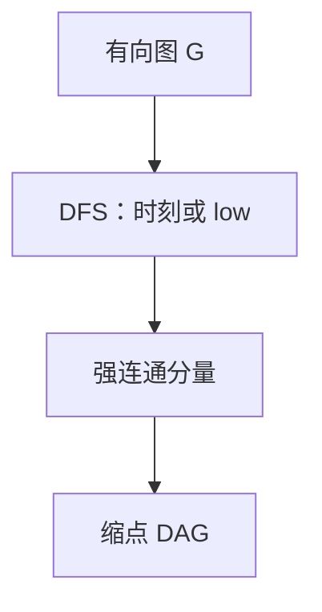

# 强连通分量 Tarjan / Kosaraju

有向图里相互可达的点落在同一块；一次 DFS 的 low 值，或正图加转置图各一次 DFS，都能在线性时间捏出这些块。

<footer>—— 据 Tarjan, Depth-First Search and Linear Graph Algorithms, 1972；Kosaraju（未发表讲义，Sharir 1981 记述）；CLRS 第 22.5 节整理</footer>

[上一课](/cs/randomized-algo)把随机化直觉收进工具箱：Las Vegas 正确、时间随机，Monte Carlo 可错、可重复压错误，硬币在算法内、不代替 NP 证书。本课程仍在图、代数、DP 与近似——不重写 Transformer，也不进入限价簿。主干[DFS 与边分类](/cs/dfs-edge-types)已给发现/完成时刻；[连通分量与桥](/cs/bcc-bridge)用 `low` 切无向图。缺口是**有向图的强连通分量**（SCC）：$u$ 与 $v$ 同块当且仅当 $u$ 可达 $v$ 且 $v$ 可达 $u$。后课默认已经会缩点成 DAG。

## 问题

无向连通只问「删边后是否断开」。有向图可以有环、有单向桥。SCC 是极大相互可达集。缩每个 SCC 成一点，块间边构成 DAG：再无有向环。缺口不是再证括号定理，而是把环捏成点。

Kosaraju：先对原图 DFS，记下完成时刻降序；再对转置图 $G^T$ 按该序 DFS，每棵树是一个 SCC。直觉：完成晚的点更「源」；$G^T$ 上从源出发扫到的，正是能互相走回来的一块。Kosaraju 的第二次 DFS 可以类比「按离场顺序反向点名」：第一次 DFS 记下谁最后离场（完成最晚的点最「源」），转置图把所有箭头掉头，从最源的点出发能扫成一棵树的，恰好是互相能走回来的一块——掉头是为了把「我去得了你」翻转成「你回得来我」。

Tarjan：一次 DFS。`low[u]` 为 $u$ 的子树能摸到的、仍在栈上的最老祖先发现时刻。点进栈；当 `low[u]=d[u]`，$u$ 到栈顶弹出为一块。与无向桥的 `low` 同类，但栈维护的是「当前未完成的 SCC 候选」。

### 两种线性，不是两种定义

SCC 是图论对象。算法是实现。不要把第二次 DFS 当成「必须转置」的定义；也不要把 Tarjan 的栈当成 Kosaraju 的完成序。二者都是 $\Theta(V+E)$。

Tarjan 1972 同时给 SCC 与双连通。Kosaraju 的两次 DFS 经 Sharir 1981 进入教材。CLRS 22.5 写 Kosaraju。后课 2-SAT 把蕴涵图画成 SCC。

## 方法

任选其一。Kosaraju 实现干净：完成时刻数组 + 邻接表转置。Tarjan 省一次图扫描，需栈与 `low`。缩点：为每个 SCC 编号，原边若两端不同块则连块边，去重。

```mermaid
flowchart TD
  G["有向图 G"] --> DFS["DFS：时刻或 low"]
  DFS --> SCC["强连通分量"]
  SCC --> DAG["缩点 DAG"]
```

孤立点是平凡 SCC。有向环上全体点同一块。DAG 本身每个点一块。

数字实例：设 $d[a]=1$，$a\to b\to a$ 构成环——b 回看时发现 a 还在栈上，取 $\mathrm{low}[b]=\min(d[b],d[a])=1$，回传后 $\mathrm{low}[a]$ 也是 1，与 $d[a]$ 相等——a 弹栈时把 b 一起带走，环上全体落进同一块。这就是「栈上候选」的实际含义。

## 机制

缩点 DAG 上可拓扑。路径存在性：块内任意两点互相达；块间沿 DAG 走。2-SAT、差分约束的可行、有向图的传递闭包加速，都先缩点。不要在原图上对每个点对再 DFS——那是 $O(V(V+E))$。

```mermaid
flowchart TD
  V["＂访问 u：记发现时刻 d［u"]，u 进栈"] --> NB["遍历后继 v"]
  NB -->|"v 未访问"| REC["递归 v，回来取<br/>low[u] = min(low[u], low[v])"]
  NB -->|"v 还在栈上"| BACK["u 摸到更老的 v<br/>low[u] = min(low[u], d[v])"]
  REC --> TEST{"low[u] = d[u] ?"}
  BACK --> TEST
  TEST -->|"否"| UP["把 low 传给父节点继续"]
  TEST -->|"是"| POP["u 到栈顶全部弹出：一个 SCC"]
```

初学者容易把缩点后 DAG 的边数当成增长率来估复杂度，实际上缩点本身的成本由原图的 $V+E$ 决定，块数与块边数是输出而非输入规模；最坏情形（每个点自成一个块）块边可达 $E$ 条，去重要用哈希或排序，别忘计入。

与无向 BCC：对象不同。桥是边割；SCC 是点的可达等价类。Tarjan 的 `low` 在两类问题里公式相近，栈与无向边的处理不要混抄。

## 边界

本课不写 2-SAT 的赋值、不写欧拉回路。不引入 Gabow 的第三种线性算法细节。有向图的桥（弧割）与 2-边连通是另一套，不插入。后课默认：SCC 可线性算出；缩点后是 DAG。

下一课把布尔公式的 2-CNF 变成蕴涵图，SCC 决定可否满足。

## 小结

- 强连通 = 相互可达；缩点得 DAG。
- Kosaraju 两次 DFS；Tarjan 一次 DFS + 栈。
- 代价 $\Theta(V+E)$；后课当黑盒用。
- 出处：Tarjan, 1972；Sharir 记述的 Kosaraju；CLRS 第 22.5 节。
