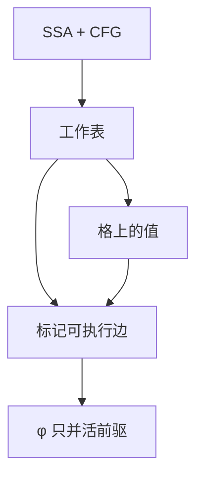

# SCCP

稀疏条件常量传播同时走 SSA 的 def-use 与 CFG 的可执行边：未执行的枝不产生常量冲突，于是更多名变成常量。

<footer>—— 据 Wegman and Zadeck, Constant Propagation with Conditional Branches, 1991；Cytron SSA 论文对照整理</footer>

上一课[常量传播](/cs/constant-propagation)在「所有到达定值」上取交，死枝上的写仍会把格打成非常量。缺口是 **SCCP**：只沿可能执行的边传播，φ 只合并已执行前驱。本课钉工作表与可执行标志，不重写简单传播的折叠规则。

## 问题

`if (1) x=2; else x=3;` 简单交得「非常量」，其实 $x=2$。SCCP：边先标不可执行，常量条件为真则只放行真枝。缺口是**控制流与数据流联立**，不是新的折叠表。

稀疏：用 SSA 的 use 链当工作表，不扫全部程序点。这与稀疏数据流家族一致。

### 「可执行」是分析结论

未访问边当不执行是可靠近似的一边：永远不把死枝当活。反面：条件未知则两边都活，退回简单传播。不要把 SCCP 当路径敏感的全部符号执行。

Wegman–Zadeck 1991（TOPLAS）。Clang/LLVM 的 SCCP/IPSCCP 是工程后裔。本课过程内；过程间是 IPSCCP，后课过程间分析点名。

## 方法

格：未定义 / 常量 / overdefined。工作表：SSA 边与 CFG 边。规则：操作数 overdefined 则结果 overdefined；常量则折；φ 忽略不可执行前驱。分支：条件为常量则只标记一侧边。

实现：未定义与 overdefined 的次序要按论文：先当未定义，避免乐观错误。Wegman–Zadeck 给了格与初始化。

## 机制

与死代码：不可执行块可删，但正式 ADCE 下一课。SCCP 露出的常量调用可能变成死参数。

过程间：若形参在所有活调用点是同一常量，可钉死——需调用图，后课。

## 边界

本课不写符号执行的路径爆炸。后课默认：条件常量用 SCCP。下一课 CSE/GVN：相等的是表达式，不只是立即数。

也不把 SCCP 当证明助手。

## 小结

- SCCP：可执行边 + SSA 稀疏传播。
- 死枝不参与 φ，精度高于简单交。
- 条件未知则两边都活。
- 出处：Wegman and Zadeck, 1991；对照 Cytron SSA、龙书常量传播。
