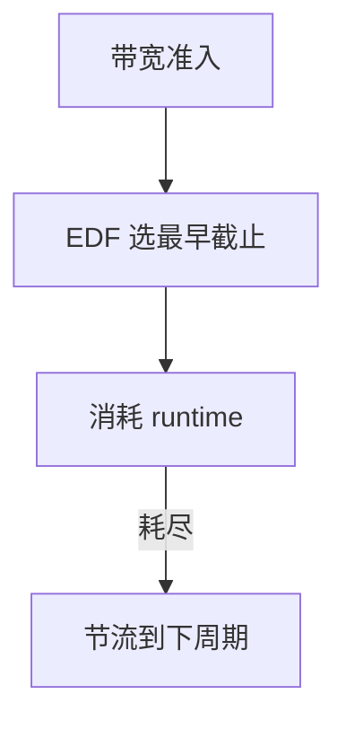

# SCHED_DEADLINE

SCHED_DEADLINE 实现 CBS：任务申报运行时、周期与截止，内核保证在截止前给够预算，否则节流。

<footer>—— 据 Linux sched-deadline 文档；Abeni 与 Buttazzo 对 CBS 的论述；POSIX sporatic server 直觉</footer>

[EEVDF](/cs/eevdf) 是尽力公平。[异构](/cs/heterogeneous-core-sched) 是容量。硬实时要 **带宽隔离**。缺口是 deadline 调度类：全局 EDF + CBS，不是用户写一个定时器循环。

## 问题

`sched_setattr`：runtime ≤ deadline ≤ period。准入：总和不超过 CPU 带宽（可留 5% 给其它）。运行：EDF 选最早截止，用尽 runtime 则节流到下周期。缺口：与 FIFO/RR 的优先级关系（DL 高于 RT 高于 CFS，通常）；fork 不继承；亲和与全局队列。本课不把 GEDF 可调度性证明展开成课程。

错过截止会统计，不自动变 CFS。对象是 CPU 时间，不是磁盘 deadline 调度器。

## 方法

准入会计 → 入 DL 队列。tick/hrtimer 扣 runtime。对照 [blk mq-deadline](/cs/blk-schedulers)：名字像，对象不是 bio。对照 [memcg](/cs/memcg)：一个限内存，一个限 CPU 时间形状。对照 EAS：DL 任务往往不参与省电迁移。

## 机制

CBS 把「周期性工作」收成内核保证，使媒体与控制回路不必靠 nice。过载被准入挡住，而不是大家一起错过。不要写成航空认证。与 [NAPI](/cs/napi)：硬中断仍可拉延迟，后课 PREEMPT_RT。

用户必须诚实申报；瞒报 runtime 会自己被节流。

实现上：runtime 用尽会节流到下周期，看起来像卡顿而不是降 nice。全局 EDF 在多核上要迁任务，亲和会破坏保证。用户必须用 SCHED_FLAG_RESET_ON_FORK 避免子进程继承。 读法上只引用[上一课](/cs/heterogeneous-core-sched)的结论，不把对象换成训练推理或限价簿。

本课在操作系统进阶的「调度进阶 / 公平、实时与能耗」课序里，对象是 **SCHED_DEADLINE**。

- 先修只引用，不重导：上一课的结论当公理，本课只补差。
- 五栏不吞并：不把本课写成大模型训练/推理，也不写成限价簿或权重量化。
- 文献用 OSTEP、McKusick、内核文档与具名会议论文；不发明 arXiv 编号。

## 边界

本课不引入 DL 服务器给 CFS 的全部。不保证与 cgroup cpu.max 的每一种组合直观。下一课把内核变成可抢占实时：PREEMPT_RT。

版本字段会变，课序钉的是机制对象「SCHED_DEADLINE」，不是某一主线内核的结构体名。
后课默认：CPU 可按 CBS 保证预算。完全抢占内核，下一课 PREEMPT_RT。

## 小结

- SCHED_DEADLINE：CBS 预算 + EDF 选择 + 准入。
- 高于普通 CFS/RT 的一类（常规配置）。
- PREEMPT_RT 是下一课。
- 出处：Linux sched-deadline；CBS 文献。
