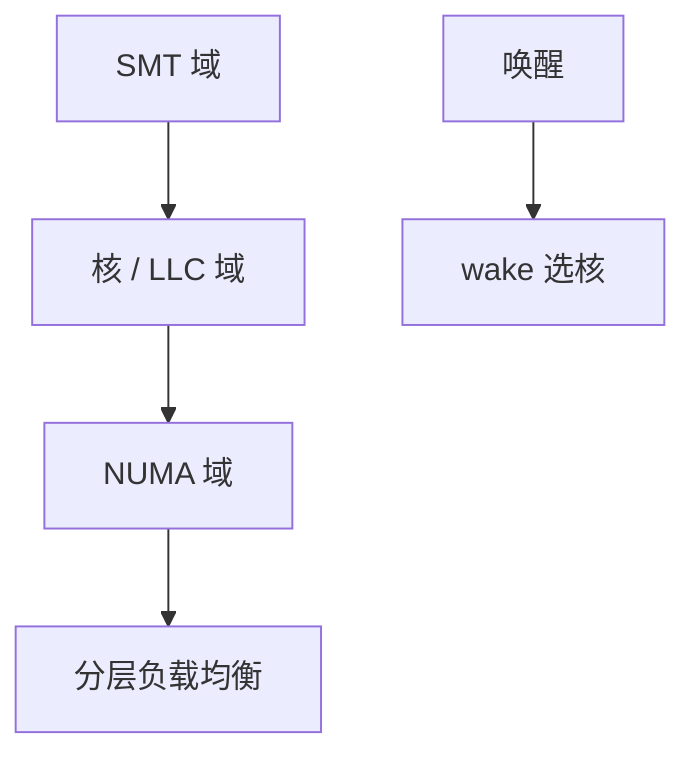

# 调度域与拓扑

调度域按 SMT、核、LLC、NUMA 分层：负载均衡先在小域做，跨节点迁移更贵，所以更懒。

<footer>—— 据 Linux 对 sched domains 的文档；Lameter 对 NUMA 的论述；[NUMA 策略](/cs/numa-mempolicy) 为内存侧先修</footer>

[EEVDF](/cs/eevdf) 在单队列上选任务。多核要 **在哪一 CPU 上跑**。缺口是调度域：拓扑感知的负载均衡，不是再讲 vruntime。

## 问题

每次 tick 若在全机找最闲 CPU，锁和缓存都炸。域：SMT 兄弟 → 共享 L2/L3 的核 → NUMA 节点 → 机器。均衡周期与阈值随层变。缺口：新任务 wake 的选核（wake_affine）；idle 平衡；与 cpuset 缩小的域。本课不把每个 `SD_FLAG` 背完。

非对称核（大核小核）在异构课。这里先钉对称拓扑层。IRQ 与 NAPI 亲和是另一条线，但同拓扑。

## 方法

`load_balance`：在某域找忙组与闲组，拉任务。跨 NUMA：考虑页所在节点（与 mempolicy 互动）。对照 [RSS](/cs/rss-multiqueue)：包绑队列；任务绑 CPU，可迁移。对照 [compaction](/cs/page-migration-compaction)：一个迁页，一个迁任务。

## 机制

调度域把「多核是一棵延迟树」收成均衡策略，使共享缓存的迁移优先于跨节点。这是吞吐与延迟的几何。不要写成主板购物。与 [KPTI](/cs/kpti-os)：迁移后 TLB 本来就要重建。

错误拓扑（固件错报）会导致永远跨节点蹦，看起来像性能 bug。

实现上：固件把不共享缓存的核标成共享，均衡会打错。cpuset 缩小域后，孤立的 CPU 不再参与全局 steal。新任务 wake_affine 优先唤醒者的 LLC 域。 读法上只引用[上一课](/cs/eevdf)的结论，不把对象换成训练推理或限价簿。

本课在操作系统进阶的「调度进阶 / 公平、实时与能耗」课序里，对象是 **调度域与拓扑**。

- 先修只引用，不重导：上一课的结论当公理，本课只补差。
- 五栏不吞并：不把本课写成大模型训练/推理，也不写成限价簿或权重量化。
- 文献用 OSTEP、McKusick、内核文档与具名会议论文；不发明 arXiv 编号。

## 边界

本课不引入 cluster scheduling 的全部新层。不保证虚拟机里暴露的拓扑真实。下一课在拓扑上再叠能耗：EAS。

版本字段会变，课序钉的是机制对象「调度域与拓扑」，不是某一主线内核的结构体名。
后课默认：迁移按域分层。按能耗模型选核，下一课 EAS。

## 小结

- 调度域镜像 SMT/LLC/NUMA 层次。
- 均衡与唤醒选核都看域。
- EAS 是下一课。
- 出处：Linux sched-domains；Lameter NUMA。
