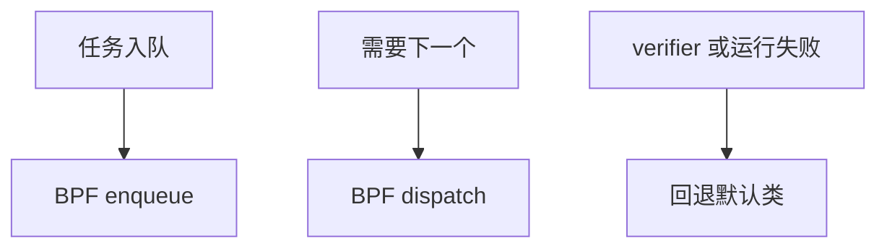

# sched_ext 与 BPF 调度器

sched_ext 把调度类的入队、选下一个、时间片交给 BPF 程序，使自定义策略不必改内核 C 代码。

<footer>—— 据 Linux sched_ext 文档；eBPF 验证器约束；[XDP](/cs/xdp-ebpf) 为可编程数据面先修</footer>

[cgroup CPU](/cs/cgroup-cpu-sched) 仍是固定算法。[eBPF](/cs/xdp-ebpf) 已在网络早路径出现。缺口是 **把调度策略变成可加载 BPF**：SCX。

## 问题

数据中心想按作业类型选核，主线 CFS 不够。sched_ext：新调度类，回调 `enqueue`/`dispatch` 在 BPF 中。缺口：verifier 保证不能死循环太久；错误程序踢回 CFS；与 RT/DL 的优先级关系。本课不把每个示例调度器（scx_simple）当产品。

仍在内核态跑 BPF，不是用户态 M:N。失败安全是硬要求。

## 方法

加载 scx 程序 → 任务可选 SCX 策略 → BPF 维护自己的队列（map）。对照 XDP：一个选包命运，一个选任务。对照 [FUSE](/cs/fuse)：FUSE 出核；SCX 仍在核内 JIT。对照 EEVDF：可在 BPF 里实现别的公平。

## 机制

sched_ext 把调度器从编译进内核的算法变成可热更新策略，同时用 verifier 限制危害。它不自动正确。不要写成 AI 调度器营销。与 [PREEMPT_RT](/cs/preempt-rt)：RT 路径通常不交给随意 BPF。

调试：BPF 统计 map；错误会导致抖动回退。

实现上：BPF 调度器崩溃或 verifier 失败必须回退，否则机器不可调度。map 里自己维护的队列要处理迁移和热插 CPU。与 RT 类的优先级关系由内核固定。 读法上只引用[上一课](/cs/cgroup-cpu-sched)的结论，不把对象换成训练推理或限价簿。

本课在操作系统进阶的「调度进阶 / 公平、实时与能耗」课序里，对象是 **sched_ext 与 BPF 调度器**。

- 先修只引用，不重导：上一课的结论当公理，本课只补差。
- 五栏不吞并：不把本课写成大模型训练/推理，也不写成限价簿或权重量化。
- 文献用 OSTEP、McKusick、内核文档与具名会议论文；不发明 arXiv 编号。

## 边界

本课不引入所有 kfunc。不保证稳定 ABI。下一课用户态 M:N：协程调度与内核线程的关系。

版本字段会变，课序钉的是机制对象「sched_ext 与 BPF 调度器」，不是某一主线内核的结构体名。
后课默认：公平类策略可 BPF 化。用户态调度与 M:N，下一课。

## 小结

- sched_ext 用 BPF 实现调度回调。
- 失败回退；verifier 限制程序。
- 用户态调度是下一课。
- 出处：Linux sched_ext；eBPF；XDP 对照。
