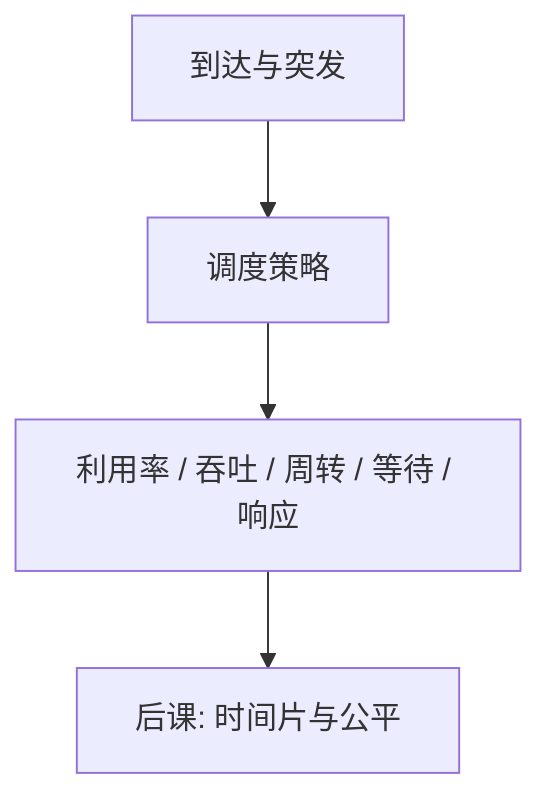

# 调度指标

调度算法的好坏取决于你先关心吞吐、等待、响应，还是公平；没有单一最优。

<footer>—— 据 Silberschatz et al., Operating System Concepts 整理</footer>

[上一课](/cs/idle-thread)让阻塞的调用能被唤醒，于是就绪队列里经常挤着多条线程。[上下文切换](/cs/context-switch)已经能换谁上 CPU。缺口是：还没有尺子。本课只定义指标，不选时间片，也不引入公平调度器。

## 问题

「一直跑当前线程直到它退出」实现最简单，但短交互会被长计算挡住。反过来，切得太勤，切换本身吃掉吞吐。缺口不是再写一遍 PCB，而是先说清楚要优化什么：**CPU 利用率、吞吐、周转时间、等待时间、响应时间**，以及公平（相近的线程不应一个饿死）。数字实例：作业 $t=0$ 到达、$t=3$ 首次上 CPU、$t=10$ 完成、中间排队共 5 秒——周转 $=10-0=10$，响应 $=3-0=3$，等待 $=5$。三个数回答三个不同的问题：多久交付、多久有反应、多少时间白等。

实时期限是再下一课的对照；本课的对象是分时与批处理混在一起的通用指标。

周转 = 完成时刻 − 到达；等待 = 在就绪队列里的时间；响应 = 首次获得 CPU 的时刻 − 到达。三个量不是同一个。

## 方法

对一组作业给出到达时间与 CPU 突发，按某策略模拟，算出上述均值。FCFS 的传送带效应、SJF 的短作业偏向、轮转的响应，都用同一套数字比较。本课不把证明「SJF 平均等待最优」写全，只锁定：换指标，名次就换。

```mermaid
flowchart TD
  JOBS["到达与突发"] --> POL["调度策略"]
  POL --> M["利用率 / 吞吐 / 周转 / 等待 / 响应"]
  M --> NEXT["后课: 时间片与公平"]
```

利用率与吞吐是系统视角；周转与响应是作业视角。公平不是均值能代替的：均值很好仍可有人饿死。初学者容易把「平均周转短」当成调度器好，实际均值会掩盖饿死：让 99 个作业各周转 1 秒、1 个作业周转 1000 秒，均值仍然漂亮——公平必须单独考核，推不出来。

## 机制

指标让后课的时间片与权重有落点：缩短时间片通常改善响应、损害吞吐（切换变多）。下半部唤醒只是把线程放进就绪队列，**不**决定它何时跑；决定权在调度器，调度器按这些指标被评价。

```mermaid
flowchart LR
  A["t=0 到达"] --> W1["就绪队列等待"]
  W1 --> S["t=3 首次上 CPU<br/>响应 = 3"]
  S --> IO["t=5 磁盘阻塞：让出 CPU"]
  IO --> W2["重新排队"]
  W2 --> S2["t=8 恢复运行"]
  S2 --> F["t=10 完成<br/>周转 = 10，等待 = 5"]
```

时间片的取舍可以类比红绿灯配时：绿灯给得太短（片太小），车刚起步就得停，路口空转（切换开销）吃掉通行量；给得太长，横向车流等到冒烟（响应变差）。指标的冲突，正是后课用虚拟运行时间做公平调度的起点。

I/O 与 CPU 突发交替：线程在磁盘上阻塞时，调度别人能提高利用率。这是中断下半部存在的调度理由，不是新的设备模型。

## 边界

本课不引入多核负载均衡、不把尾延迟当唯一指标，也不把「优先级反转」展开——那要锁。作业长度若未知，SJF 只能估计；本课承认估计误差，不把启发式写完。

实时对照课会换尺子：截止时间不是周转时间的别名，本课先不混用。

后课默认：谈到「调度得好」，必须先说哪一根尺子。通用分时如何用时间片与虚拟运行时间去逼近公平，下一课收。

## 小结

- 就绪队列有人之后，先定义利用率、吞吐、周转、等待、响应与公平。
- 同一策略在不同指标下优劣会翻盘。
- 时间片与 CFS、实时调度都是后课用这些尺子去设计的。
- 出处：Silberschatz et al., *OSC*；Tanenbaum and Bos, *MOS*。
