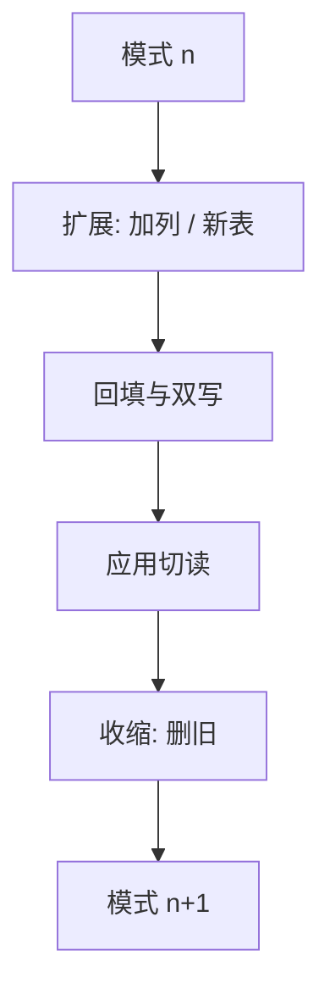

# 模式演化与迁移

模式会变：加列、改约束、拆表。迁移是把旧实例变成新实例的事务脚本，失败必须停在可恢复的状态。

<footer>—— 据 Sjøberg 对模式演化；Ramakrishnan and Gehrke；Curino et al. 对数据库演化工具的整理</footer>

[上一课](/cs/savepoints)给出事务内部分撤销。本课不重定义 UNDO。缺口是**模式本身是版本化对象**：应用要发新版本，表结构、约束、视图定义一起变。主干关系模型假设模式给定；进阶必须处理「给定」会过期。迁移（migration）是有序 DDL + 数据回填，通常包在事务或可重入步骤里。

## 问题

加可空列往往便宜；加 `NOT NULL` 无默认值则要先回填。改列类型可能重写整表。拆表是 [范式](/cs/normal-forms) 在时间轴上的再执行：先建新表、拷数据、改写应用、再删旧列。缺口不是某家 `ALTER` 语法，而是合同：每一步之后约束仍成立，失败可重跑或回滚，读写应用有窗口看到哪一版模式。

在线变更：大表加索引会锁写。有的引擎用拷贝表、触发器双写、切名的方式缩短锁窗。本课点名策略，不把每家 Online DDL 当标准代数。

扩缩容分片是后课分布式问题。本课单库逻辑模式。版本号表（schema_migrations）记录已应用脚本，是工程惯例，不是关系理论新原语。

## 方法

正向迁移：版本 $n$ 到 $n{+}1$ 的脚本，幂等更好。回滚脚本：不是总能自动生成（删列可逆，丢数据的合并不可逆）。扩展–迁移–收缩：先加新结构（扩展），应用双写或读新，再回填（迁移），最后删旧结构（收缩），避免「改完立刻不兼容」。

视图与存储过程依赖列名：改名要先改定义。约束与触发器课已说明不变式；迁移中途可能短暂放松约束，必须在脚本末恢复，并处理违反行。

## 机制

DDL 的事务性因引擎而异：有的 `ALTER` 可与 DML 同事务并回滚，有的隐式提交。保存点帮不上隐式提交。锁：改表可能拿 ACCESS EXCLUSIVE，与长查询冲突——这是运维窗口问题，不是代数。

兼容性：旧应用读新模式应仍能跑（只加列、不加强制约束）直到应用升级。这是数据独立性在时间上的版本：外模式尽量稳，内模式可以先变。

## 边界

本课不讲 ORM 迁移工具的文件格式——下一课阻抗失配会碰到它们生成的 SQL。也不把蓝绿数据库集群当本课必做。复制环境里 DDL 如何跟逻辑日志走，后课 CDC 再接。

后课默认：模式变更是带版本的脚本，不是生产上手改列。下一课 ORM：对象图与关系之间的缝，迁移工具常从这边生成。

不可逆迁移要当数据丢失预算显式签字，不能靠「事务回滚」幻想。

## 小结

- 迁移把实例从模式 $n$ 送到 $n{+}1$，约束在步骤边界成立。
- 扩展–迁移–收缩缩短不兼容窗口；DDL 事务性因引擎而异。
- ORM 阻抗下一课：对象与表的翻译如何把迁移变复杂。
- 出处：Sjøberg；Ramakrishnan and Gehrke；Curino 等演化工作。
